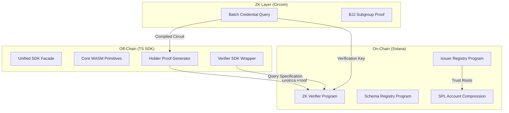

# SolID Protocol

[](https://github.com/solid-protocol/solid-protocol/actions/workflows/build.yml)
[](https://opensource.org/licenses/MIT)
[](https://explorer.solana.com/?cluster=devnet)

**Private, ZK-powered credential verification for the Solana ecosystem.**

<<<<<<< HEAD
SolID allows Solana applications to verify user eligibility—KYC, age, membership, or accreditation—without ever handling or storing private user data. Verification is performed on-chain via Groth16 zero-knowledge proofs, ensuring complete privacy for the holder and cryptographic certainty for the verifier.
=======
   [Simulator](https://app.solidislive.com) | 
   [Indexer](https://api.solidislive.com) | 
   [Circuit artifacts](https://artifacts.solidislive.com) | 
   [Manifest](https://api.solidislive.com/v1/manifest)

## What problem this solves
>>>>>>> be3062dfabcf4099e5a171d8fcd5d104e700cb9c

## What is SolID?

<<<<<<< HEAD
SolID is a decentralized identity protocol designed for the privacy-first web3 era. It solves the "regulatory vs. privacy" dilemma for Solana developers by providing a standard for:
1. **Private Proofs**: Holders generate ZK proofs that satisfy verifier requirements (e.g., "Age > 18") without revealing the underlying attribute value or their identity.
2. **On-Chain Verification**: Proofs are verified by a specialized Solana program using efficient `alt_bn128` syscalls.
3. **Decentralized Trust**: A DAO-governed registry manages issuer enrollment, trust roots, and schema definitions.
=======
1. Collect and store PII themselves (regulatory exposure).
2. Outsource to a centralized KYC iframe (still hold a token; centralized
   trust).
3. Maintain an allowlist (operationally painful; non-portable).
4. Use a non-private soulbound token (privacy is gone).

SolID gives them a fifth option:

> A Solana program privately verifies an issuer-signed claim and learns
> only `eligible: true` plus a few public predicate parameters.
> The user's name, ID number, address, and date of birth never leave the
> holder.

## Where SolID fits

Four roles, four products:

| Role     | Question they need answered                                | Today's answer                                                                                |
| -------- | ---------------------------------------------------------- | --------------------------------------------------------------------------------------------- |
| Verifier | "Can this wallet do this action right now?"                | Submit a holder-generated proof to `verify_batch_proof_v2`; check `verified: true`.           |
| Issuer   | "Can I issue and revoke a credential for this user?"       | `register_issuer` (with on-chain BJJ subgroup proof) + DAO approval + `issue_credential` CPI. |
| Holder   | "What am I revealing, and what stays private?"             | Hold credential locally; generate a Groth16 proof scoped to the verifier and a query.         |
| Operator | "Are the trust roots and artifacts what they should be?"   | All program IDs + VK + artifact hashes pinned and CI-gated; see `docs/DEVNET_STATUS.md`.      |

Today the devnet protocol, public artifact host, indexer/API, manifest,
and `solid-sim` product surface are live under `solidislive.com`.
Verifier SDK publication is the next external-developer milestone.


## How a verification flow looks today

App developers should start with the high-level verifier SDK. It builds a
typed requirement, requests a holder proof through a transport, submits the
proof on-chain, and returns a stable success/failure result:

```ts
import { SolidVerifier, walletAdapterTransport } from "@solid-protocol/verifier";

const solid = new SolidVerifier({
  cluster: "devnet",
  artifactHostUrl: "https://artifacts.solidislive.com",
  indexerUrl: "https://api.solidislive.com",
});

const result = await solid.verifyRequirement({
  wallet: wallet.publicKey,
  payer: verifierPayer,
  spec: {
    schema: "basic_identity_v2",
    predicates: [
      { field: "verification_level", op: ">=", value: 2 },
      { field: "country_code", op: "!=", value: 840 },
    ],
    action: { appId: "my-launchpad", action: "join_pool_42" },
  },
  transport: walletAdapterTransport(wallet),
});

if (result.verified) allowUser();
```

This is the verifier alpha path. The hosted API and artifacts are live,
but verifier SDK npm publication is still pending.

## Quick start

Prerequisites: the toolchain pinned by `flake.nix` and
`scripts/bootstrap.sh` provisions `.toolchain/bin/`. You need
exactly:

- Rust 1.79.0 + `wasm32-unknown-unknown`
- Solana CLI 1.18.22, Anchor 0.30.1
- circom 2.1.9, snarkjs 0.7.5, wasm-pack 0.13.1
- Node 18 + npm 10

```
nix develop                    # or: bash scripts/bootstrap.sh
export PATH="$PWD/.toolchain/bin:$PATH"

# Build
cd circuits && npm install && node scripts/setup.js && cd ..
wasm-pack build wasm/ --target nodejs --out-dir ../ts-sdk/packages/core/wasm --release
bash scripts/sync_program_keypairs.sh
anchor build
cd ts-sdk && npm ci && npm run build && cd ..

# E2E (clean-slate localnet)
COPYFILE_DISABLE=1 COPY_EXTENDED_ATTRIBUTES_DISABLE=1 \
  solana-test-validator --reset \
    --clone-upgradeable-program cmtDvXumGCrqC1Age74AVPhSRVXJMd8PJS91L8KbNCK \
    --clone-upgradeable-program noopb9bkMVfRPU8AsbpTUg8AQkHtKwMYZiFUjNRtMmV \
    --url https://api.devnet.solana.com &
bash scripts/sync_program_keypairs.sh --reset-state
anchor deploy --provider.cluster localnet
export SOLID_VOTING_PERIOD_SECONDS=120
npm run e2e
```

`npm run e2e` runs `init-onchain` -> `backfill-issuer-tree` ->
`bootstrap-schema-tree` -> `bootstrap-issuer` -> `issue` -> `prove`
end-to-end and exits 0 with a final `verified: true` log line on
the local validator.
>>>>>>> be3062dfabcf4099e5a171d8fcd5d104e700cb9c

## Architecture

SolID is a full-stack protocol spanning from low-level ZK circuits to a high-level TypeScript SDK.




## Quick Start

### Build from source

Prerequisites: Rust 1.79+, Solana CLI 1.18+, Node 18+, and Circom 2.1.9.

<<<<<<< HEAD
```bash
# Clone the repository
git clone https://github.com/solid-protocol/solid-protocol.git
cd solid-protocol

# Install dependencies and build circuits
cd circuits && npm install && node scripts/setup.js && cd ..

# Build programs
anchor build

# Install SDK dependencies and build
cd ts-sdk && npm install && npm run build
```

## Programs & SDKs

| Program | ID | Description |
| --- | --- | --- |
| **Issuer Registry** | `5fxh...VjMx` | Manages issuer enrollment, DAO voting, and trust roots. |
| **ZK Verifier** | `cmtD...bNCK` | Validates Groth16 proofs and nullifier replay protection. |
| **Schema Registry** | `noop...VmV` | Stores canonical schema definitions and tree bindings. |

| Package | Purpose |
| --- | --- |
| `@solid-protocol/core` | Poseidon, BabyJubJub, and nullifier WASM primitives. |
| `@solid-protocol/holder` | Groth16 proof generation and Merkle path management. |
| `@solid-protocol/verifier` | High-level API for on-chain verification in frontend apps. |
| `@solid-protocol/issuer` | Credential signing and BJJ subgroup proof generation. |

## Console Simulator

Test the full protocol flow end-to-end using our interactive **SolID Console**. It provides a frictionless sandbox for registering as an issuer, minting test governance tokens, and verifying proofs on devnet.

[Go to Console Simulator](https://github.com/akash-R-A-J/solid-sim)

## License

Dual licensed under [Apache-2.0](LICENSE-APACHE) or [MIT](LICENSE-MIT) at your option.
=======
## Trust model

- **DAO-governed issuers.** Issuers stake SOL, are admitted via
  token-weighted vote with a 100-slot flash-loan window, and prove
  on-chain that their BabyJubJub key sits in the prime-order subgroup
  before they can issue (Phase E close-out, 2026-05-02).
- **Atomic revocation.** `revoke_issuer_atomic` flips status, bumps
  the revocation nonce, CPIs `replace_leaf` into the SPL AC issuer
  tree, and writes the new Poseidon root into `IssuerTreeBinding`
  in a single instruction. Old proofs become un-replayable
  immediately because their nullifier universe is keyed on the
  pre-revocation `issuerTreeRoot`.
- **Slashing.** Lamports move atomically from the issuer's stake
  vault to the DAO treasury PDA via `slash_issuer` and
  `submit_fraud_proof`. (Both will be governance-multisig-gated
  before mainnet; SOLID-SEC-013.)
- **Voting discipline.** `vote_on_issuer` enforces the deadline,
  increments `active_votes_count`, and refuses unstake until
  `release_vote` is called -- voters cannot withdraw governance
  weight to a winning side mid-vote.
- **Backend-agnostic verifier.** The verifier reads trust roots by
  byte offset and rejects accounts whose owner is not the expected
  registry program. The SPL AC backend can be swapped without a
  circuit change.

## License

[MIT](LICENSE-MIT)
at your option.
>>>>>>> be3062dfabcf4099e5a171d8fcd5d104e700cb9c
