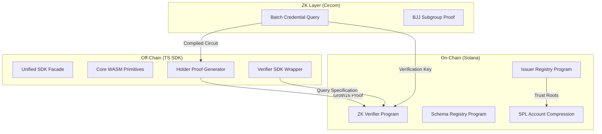

# SolID Protocol

[](https://github.com/solid-protocol/solid-protocol/actions/workflows/build.yml)
[](https://opensource.org/licenses/MIT)
[](https://explorer.solana.com/?cluster=devnet)

**Private, ZK-powered credential verification for the Solana ecosystem.**

SolID allows Solana applications to verify user eligibility—KYC, age, membership, or accreditation—without ever handling or storing private user data. Verification is performed on-chain via Groth16 zero-knowledge proofs, ensuring complete privacy for the holder and cryptographic certainty for the verifier.

## What is SolID?

SolID is a decentralized identity protocol designed for the privacy-first web3 era. It solves the "regulatory vs. privacy" dilemma for Solana developers by providing a standard for:
1. **Private Proofs**: Holders generate ZK proofs that satisfy verifier requirements (e.g., "Age > 18") without revealing the underlying attribute value or their identity.
2. **On-Chain Verification**: Proofs are verified by a specialized Solana program using efficient `alt_bn128` syscalls.
3. **Decentralized Trust**: A DAO-governed registry manages issuer enrollment, trust roots, and schema definitions.

## Architecture

SolID is a full-stack protocol spanning from low-level ZK circuits to a high-level TypeScript SDK.




## Quick Start

### Build from source

Prerequisites: Rust 1.79+, Solana CLI 1.18+, Node 18+, and Circom 2.1.9.

```bash
# Clone the repository
git clone https://github.com/solid-protocol/solid-protocol.git
cd solid-protocol

# Install dependencies and build circuits
cd circuits && npm install && node scripts/setup.js && cd ..

# Build programs
anchor build

# Install SDK dependencies and build
cd ts-sdk && npm install && npm run build
```

## Programs & SDKs

| Program | ID | Description |
| --- | --- | --- |
| **Issuer Registry** | `5fxh...VjMx` | Manages issuer enrollment, DAO voting, and trust roots. |
| **ZK Verifier** | `cmtD...bNCK` | Validates Groth16 proofs and nullifier replay protection. |
| **Schema Registry** | `noop...VmV` | Stores canonical schema definitions and tree bindings. |

| Package | Purpose |
| --- | --- |
| `@solid-protocol/core` | Poseidon, BabyJubJub, and nullifier WASM primitives. |
| `@solid-protocol/holder` | Groth16 proof generation and Merkle path management. |
| `@solid-protocol/verifier` | High-level API for on-chain verification in frontend apps. |
| `@solid-protocol/issuer` | Credential signing and BJJ subgroup proof generation. |

## Console Simulator

Test the full protocol flow end-to-end using our interactive **SolID Console**. It provides a frictionless sandbox for registering as an issuer, minting test governance tokens, and verifying proofs on devnet.

[Go to Console Simulator](https://github.com/akash-R-A-J/solid-sim)

## License

Dual licensed under [Apache-2.0](LICENSE-APACHE) or [MIT](LICENSE-MIT) at your option.
