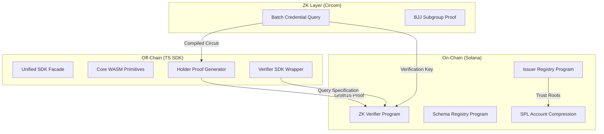

SolID Protocol
==============

Private, ZK-powered Credential Verification Engine for Solana
-------------------------------------------------------------

SolID allows Solana applications to verify user eligibility—KYC, age, membership, or accreditation—without ever handling or storing private user data. Verification is performed on-chain via Groth16 zero-knowledge proofs, ensuring complete privacy for the holder and cryptographic certainty for the verifier.

Powered by BabyJubJub, Poseidon Hash, and Groth16 Zero-Knowledge Proofs

[](https://opensource.org/licenses/MIT)
[](https://explorer.solana.com/?cluster=devnet)
[](#)

Overview
--------

SolID is a decentralized identity protocol designed for the privacy-first Web3 era. It solves the "regulatory compliance vs. absolute user privacy" dilemma for Solana developers by providing a standard for:

*   **Private Proofs**: Holders generate ZK proofs that satisfy verifier requirements (e.g., "Age >= 18" or "Country != USA") without revealing the underlying attribute value or their identity.
*   **On-Chain Verification**: Proofs are verified directly by a specialized Solana program using efficient `alt_bn128` syscalls.
*   **Decentralized Trust**: A DAO-governed registry manages issuer enrollment, trust tiers, and schema definitions.
*   **State Compression**: Utilizes SPL Account Compression (Merkle trees) to scale credential storage with minimal on-chain rent costs.

Resources & Links
-----------------

Here are the key live components of the SolID ecosystem:

*   **Live Console Simulator**: [app.solidislive.com](https://app.solidislive.com)
*   **Live Indexer API**: [api.solidislive.com](https://api.solidislive.com)
*   **ZK Proof Artifacts**: [artifacts.solidislive.com](https://artifacts.solidislive.com)
*   **System Manifest**: [api.solidislive.com/v1/manifest](https://api.solidislive.com/v1/manifest)

Architecture & Core Components
------------------------------

### System Components

#### ts-sdk/core (WASM Primitives)
*   Provides Poseidon, BabyJubJub, and nullifier WASM cryptographic primitives.
*   Loads browser-native WASM from `wasm-web/` and server-native WASM from `wasm/`.

#### ts-sdk/holder
*   Coordinates Groth16 proof generation and local Merkle path management for user wallets.

#### ts-sdk/verifier
*   A clean, developer-facing wrapper for submitting proofs to the on-chain ZK verifier program.

#### ts-sdk/issuer
*   Utility libraries for credential signing, Poseidon commitment generation, and BabyJubJub subgroup proof generation.

### Protocol Architecture



Protocol Trust Guarantees
--------------------------

*   **DAO-governed issuers**: Issuers stake SOL, are admitted via token-weighted vote with a 100-slot flash-loan window, and prove on-chain that their BabyJubJub key sits in the prime-order subgroup before they can issue.
*   **Atomic revocation**: `revoke_issuer_atomic` flips status, bumps the revocation nonce, CPIs `replace_leaf` into the SPL AC issuer tree, and writes the new Poseidon root into `IssuerTreeBinding` in a single instruction.
*   **Slashing**: Lamports move atomically from the issuer's stake vault to the DAO treasury PDA via `slash_issuer` and `submit_fraud_proof`.
*   **Deterministic verification**: The verifier program reads trust roots directly from registry accounts by byte offset, enforcing strict ownership checks.

Setup & Installation
--------------------

### Prerequisites

Ensure you have the following toolchain installed:
*   **Rust**: `1.79.0` with `wasm32-unknown-unknown` target
*   **Solana CLI**: `1.18.22`
*   **Anchor CLI**: `0.30.1`
*   **Circom**: `2.1.9`
*   **SnarkJS**: `0.7.5`
*   **Wasm-pack**: `0.13.1`
*   **Node.js**: `v18` + **npm**: `v10`

### Build Instructions

1.  **Clone the Repository**:
    ```bash
    git clone https://github.com/solid-protocol/solid-protocol.git
    cd solid-protocol
    ```

2.  **Build Circuits**:
    ```bash
    cd circuits
    npm install
    node scripts/setup.js
    cd ..
    ```

3.  **Build Core WebAssembly Primitives**:
    ```bash
    # For Node.js (Indexer and tests)
    wasm-pack build wasm --target nodejs --out-dir ts-sdk/packages/core/wasm --release --no-opt
    ```

4.  **Synchronize Program Keypairs & Build Programs**:
    ```bash
    bash scripts/sync_program_keypairs.sh
    anchor build
    ```

5.  **Build TypeScript SDK**:
    ```bash
    cd ts-sdk
    npm ci
    npm run build
    cd ..
    ```

Verification & Local Testing
-----------------------------

To run the complete E2E integration test suite against a clean-slate local Solana validator:

```bash
# Start the Solana local validator
solana-test-validator --reset \
  --clone-upgradeable-program cmtDvXumGCrqC1Age74AVPhSRVXJMd8PJS91L8KbNCK \
  --clone-upgradeable-program noopb9bkMVfRPU8AsbpTUg8AQkHtKwMYZiFUjNRtMmV \
  --url https://api.devnet.solana.com &

# Sync keypairs and deploy
bash scripts/sync_program_keypairs.sh --reset-state
anchor deploy --provider.cluster localnet

# Run end-to-end flow
export SOLID_VOTING_PERIOD_SECONDS=120
npm run e2e
```

`npm run e2e` runs the sequence: `init-onchain` -> `backfill-issuer-tree` -> `bootstrap-schema-tree` -> `bootstrap-issuer` -> `issue` -> `prove` and exits `0` with a final `verified: true` validation status.

License
-------

Dual licensed under [MIT](LICENSE-MIT) or [Apache-2.0](LICENSE-APACHE) at your option.
