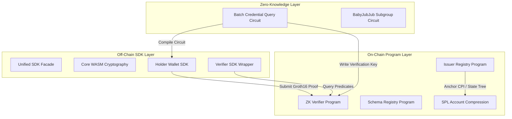

SolID Protocol
==============

Private Zero-Knowledge Credential Registry on Solana
----------------------------------------------------

SolID Protocol is an on-chain identity and private credential verification engine built on the Solana blockchain. By integrating Groth16 zero-knowledge proofs, BabyJubJub elliptic curve cryptography, Poseidon hashing, and SPL Account Compression, SolID provides a highly scalable framework for decentralized, privacy-preserving identity claims. 

Holders can mathematically prove attributes (e.g., country of residence, age threshold, or membership status) to on-chain verifiers without exposing their raw personal data or compromising their public wallet addresses.

Live System Resources
---------------------

*   **Console Simulator**: [https://app.solidislive.com](https://app.solidislive.com)
*   **Indexer API Endpoint**: [https://api.solidislive.com](https://api.solidislive.com)
*   **ZK Proof Artifact Storage**: [https://artifacts.solidislive.com](https://artifacts.solidislive.com)
*   **Active Devnet Manifest**: [https://api.solidislive.com/v1/manifest](https://api.solidislive.com/v1/manifest)

Cryptographic Foundations
------------------------

SolID relies on a custom cryptographic pipeline optimized for zero-knowledge proving and low compute-unit verification on Solana.

### 1. Poseidon Hash Function
*   **Purpose**: Used as the primary snark-friendly collision-resistant hash function for building state commitments, Merkle tree nodes, and nullifiers.
*   **Configuration**: Parametrized over the scalar field of the `bn254` (alt_bn128) curve, using 5 inputs for nullifiers to enforce replay protection without public exposure.

### 2. BabyJubJub (BJJ) Elliptic Curve
*   **Purpose**: Encodes wallet-bound identity keys. BJJ is a twisted Edwards curve birationally equivalent to a Montgomery curve, defined over the scalar field of `bn254`.
*   **Subgroup Proofs**: To prevent identity key spoofing, issuers must submit an on-chain Groth16 proof demonstrating that their derived BJJ public key lies strictly within the prime-order subgroup of the curve, shielding the registry against invalid curve attacks.

### 3. Groth16 Zero-Knowledge Proofs
*   **Purpose**: Enforces statement-level validity (e.g., credential ownership, attribute checks, and subgroup membership) with small constant-sized proof footprints (3 G1/G2 points).
*   **Solana Verification**: Uses built-in `alt_bn128` elliptic curve addition, scalar multiplication, and pairing check syscalls, keeping verification compute costs well within single-transaction limits.

On-Chain Architecture
---------------------



### Core Program Deployments (Devnet)

*   **ZK Verifier Program**: `DcyezhHYGwFTZCeb3BMJbQHFh7EyQMx8WCrKDNLbarb`
    Responsible for validating Groth16 proofs against registered verification keys (VKs) and preventing double-spending via persistent nullifier PDAs.
*   **Issuer Registry Program**: `5fxhJ1uKBtsVGq17xuVDapcTALZprNVU8Ar9mFHVijMx`
    Manages issuer lifecycle states (registration, trust tier assignments, and BJJ identity verification) and coordinates state compression via SPL Account Compression.
*   **Schema Registry Program**: `4ZCrxVBKpko7xUSrLq7zZzd87xGEKFSxFm3JG6j3CmF1`
    Acts as the source of truth for global schema definitions, attestation layouts, and permitted cryptographic configurations.

State Compression & Scalability
--------------------------------

To solve Solana's high account rent costs for millions of credentials, SolID utilizes **SPL Account Compression** (concurrent Merkle trees).

*   **Issuer and Credential Trees**: Credentials are not represented by individual on-chain accounts. Instead, they are accumulated into concurrent Merkle trees. Only the tree root is stored on-chain, reducing storage fees by over 99%.
*   **Tree Bindings**: The `IssuerTreeBinding` PDA maps a specific issuer to their active Merkle tree.
*   **Atomic Revocation**: The `revoke_issuer_atomic` instruction performs a cross-program invocation (CPI) to replace the revoked leaf in the tree, updating the root in the same transaction.

Governance, Staking, & Security
-------------------------------

*   **Registry Onboarding**: Issuers register by staking 1 SOL and submitting a subgroup proof. The application is reviewed and finalized via token-weighted DAO votes.
*   **Slash Mechanics**: If an issuer signs fraudulent data or violates protocol specifications, any participant can submit a cryptographic fraud proof on-chain to trigger the `slash_issuer` instruction, which slashes the staked SOL and transfers it to the DAO treasury.
*   **Replay Protection**: The nullifier is computed as:
    $$\text{Nullifier} = \text{Poseidon}(\text{Holder BJJ Secret}, \text{Credential Leaf Index}, \text{Tree ID}, \text{Scope})$$
    When verified, the nullifier is persisted on-chain as a PDA, preventing proof-replay attacks.

Unified TypeScript SDK Monorepo
--------------------------------

The monorepo contains modular npm packages under the `@solid-protocol` namespace:

### 1. `@solid-protocol/core`
*   Low-level WebAssembly bindings compiled from the core Rust primitives.
*   Distributes browser-native WASM (`wasm-web/`) and Server-native WASM (`wasm/`).
*   Implements Poseidon hashing, BabyJubJub key derivation, and signature validation.

### 2. `@solid-protocol/holder`
*   Client-side SDK for holders to store credential envelopes, build Merkle paths from indexer data, and compile offline Groth16 proofs.

### 3. `@solid-protocol/verifier`
*   Developer-facing module for constructing credential validation queries, generating versioned transactions using Address Lookup Tables (ALTs), and submitting verify requests.

### 4. `@solid-protocol/issuer`
*   Utility module for credential envelope encryption, commitment generation, and subgroup identity proof compilation.

Build & Environment Setup
-------------------------

### System Dependencies

*   **Rust**: Version `1.79.0` with `wasm32-unknown-unknown` target
*   **Solana CLI**: Version `1.18.22`
*   **Anchor CLI**: Version `0.30.1`
*   **Circom**: Version `2.1.9`
*   **SnarkJS**: Version `0.7.5`
*   **Wasm-pack**: Version `0.13.1`
*   **Node.js**: Version `v18+` and **npm** `v10`

### Step-by-Step Compilation

1.  **Clone the Monorepo**:
    ```bash
    git clone https://github.com/solid-protocol/solid-protocol.git
    cd solid-protocol
    ```

2.  **Generate Circuit Artifacts**:
    ```bash
    cd circuits
    npm install
    node scripts/setup.js
    cd ..
    ```

3.  **Compile WebAssembly Primitives**:
    ```bash
    # Compiles Rust crypto and places target bridges inside ts-sdk core
    wasm-pack build wasm --target nodejs --out-dir ts-sdk/packages/core/wasm --release --no-opt
    ```

4.  **Sync Keypairs and Build Smart Programs**:
    ```bash
    bash scripts/sync_program_keypairs.sh
    anchor build
    ```

5.  **Build TypeScript SDK Modules**:
    ```bash
    cd ts-sdk
    npm ci
    npm run build
    cd ..
    ```

Verification & E2E Integration Suite
-------------------------------------

To validate the complete protocol flow (initialization, Merkle tree bindings, schema registration, issuer onboarding, credential issuance, proof generation, and verification) against a clean local Solana validator:

```bash
# Start a clean local validator with state compression pre-loaded
solana-test-validator --reset \
  --clone-upgradeable-program cmtDvXumGCrqC1Age74AVPhSRVXJMd8PJS91L8KbNCK \
  --clone-upgradeable-program noopb9bkMVfRPU8AsbpTUg8AQkHtKwMYZiFUjNRtMmV \
  --url https://api.devnet.solana.com &

# Sync keypairs and deploy smart programs
bash scripts/sync_program_keypairs.sh --reset-state
anchor deploy --provider.cluster localnet

# Execute end-to-end testing script
export SOLID_VOTING_PERIOD_SECONDS=120
npm run e2e
```

Development team contacts and auditing histories are maintained locally under `/adr` and `/sec` directories.

License
-------

Licensed under either of Apache License, Version 2.0 or MIT License at your option.
