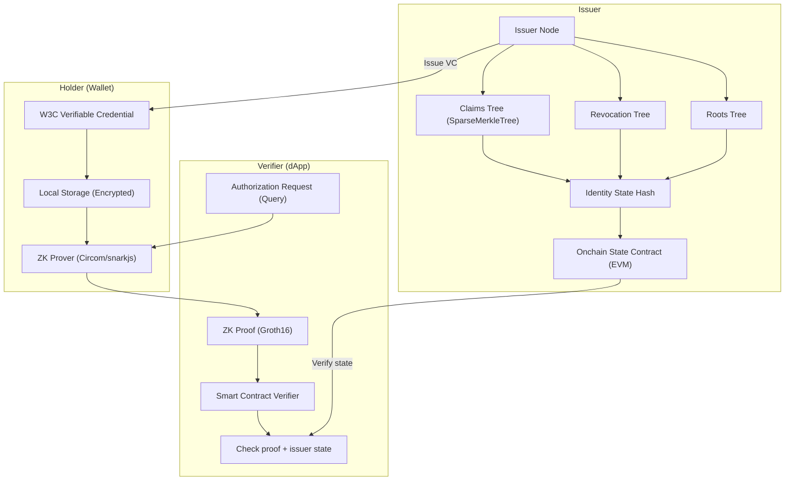
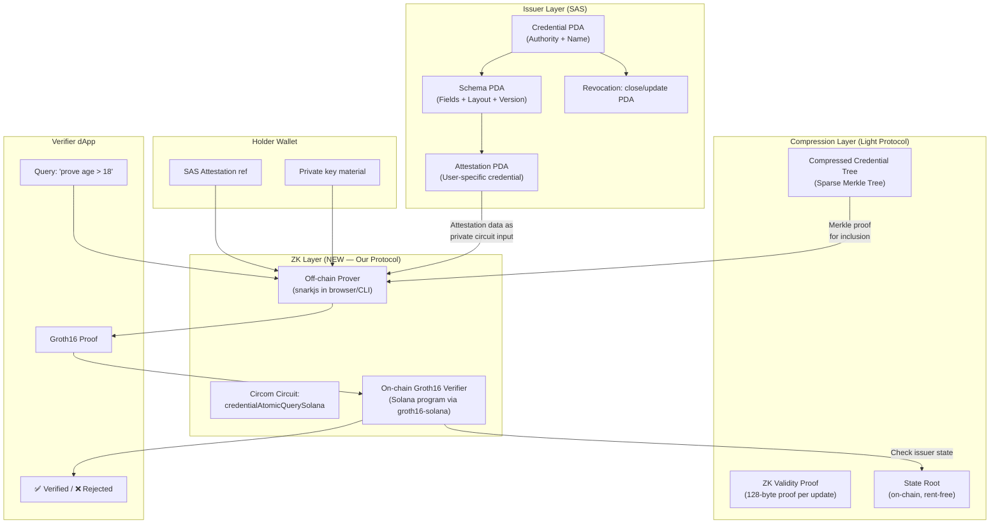
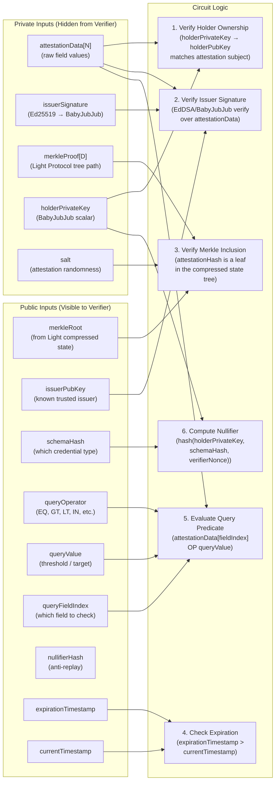
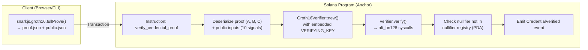
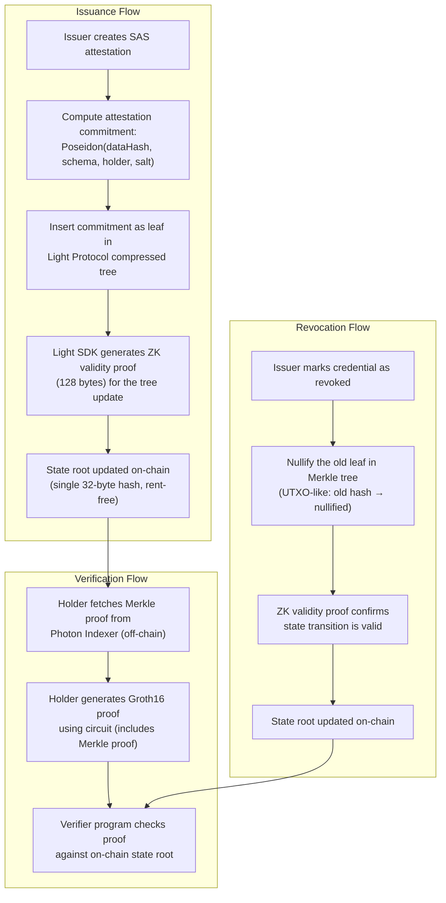
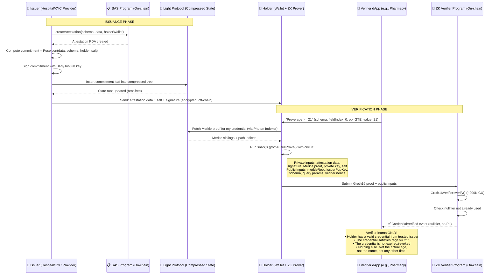

# Private Onchain Identity on Solana: Deep Technical Analysis

> [!NOTE]
> **v0.2 amendment (2026-04-20).** This deep dive is preserved as the
> canonical thesis document. The word "Light Protocol" throughout should
> be read as "compressed-state backend" — v0.1 shipped on Light; v0.2
> runs on **SPL Account Compression**. The backend-agnostic verifier
> design (roots read via PDAs, not via backend-specific CPIs) made the
> swap a drop-in: zero circuit changes, zero trusted-setup redo, zero
> public-input reordering. Every architectural argument below about
> composability, privacy, circuit design, SAS integration, and DAO
> governance still holds verbatim.

## The Thesis

Build the **Privado ID for Solana** — a general-purpose, protocol-level
ZK identity layer that combines the Solana Attestation Service (SAS)
for credential issuance, Circom/Groth16 circuits for true zero-knowledge
selective disclosure, and a compressed-state Merkle backend (SPL Account
Compression as of v0.2, Light Protocol in v0.1) for scalable credential
state.

> [!IMPORTANT]
> This is NOT another vertical identity app. This is the **infrastructure layer** that every dApp on Solana plugs into for private, verifiable credentials — the missing piece between "SAS exists" and "private identity is solved."

---

## Part 1: Root Cause Analysis — Why This Problem Is Still Open

### What's Actually Solved Today

| Component | Status | Who Solved It |
|-----------|--------|---------------|
| Onchain attestation issuance/verification | ✅ Solved | SAS (Solana Foundation, May 2025) |
| Basic privacy (no raw PII onchain) | ✅ Solved | SAS uses commitments + salts |
| Biometric Sybil resistance | ✅ Solved | VeryAI (palm-scan, $10M raise Mar 2026) |
| ZK state compression | ✅ Solved | Light Protocol (ZK Compression) |
| Groth16 verification on Solana | ✅ Solved | `groth16-solana` crate, native `alt_bn128` syscalls |

### What's NOT Solved (The Gaps You Fill)

| Gap | Why It Matters | Root Cause |
|-----|---------------|------------|
| **Full ZK selective disclosure** | Prove `age > 18` without revealing age, birth date, or anything else | SAS gives selective *reveal* (show field X, hide field Y) — NOT selective *proof* (prove predicate without revealing any field). These are fundamentally different privacy guarantees. |
| **Unlinkability / Nullifiers** | Prevent verifiers from correlating your proofs across contexts | No nullifier system exists on Solana identity. Every attestation PDA is linkable to a wallet. |
| **W3C VC interoperability** | Healthcare (HIPAA), EU (eIDAS), supply chain (ISO) all require standard credential formats | SAS schemas are custom. No W3C Verifiable Credential mapping exists. |
| **Compressed credential registries** | Millions of credentials × revocation lists = account bloat | Nobody has integrated Light Protocol with SAS for identity state. |
| **Universal verifier SDK** | One SDK call for any identity use case across any dApp | Fragmented. Each project (Civic, VeryAI, Solana.ID) has its own SDK. |
| **Issuer federation + trust model** | Who decides which issuers are trusted? How do you revoke an issuer? | No decentralized trust registry on Solana. |
| **Credential portability** | Move credentials between wallets without re-issuance | Attestation PDAs are bound to wallet address by seed derivation. |

### The Root Cause (One Sentence)

**SAS provides a *data availability* layer for attestations, but it has no *computation* layer for private claims — you can store and retrieve credentials privately, but you can't *prove arbitrary statements* about them without revealing the underlying data.**

This is exactly the gap that Privado ID fills on EVM with Circom circuits. Nobody has built the equivalent on Solana.

---

## Part 2: Privado ID Architecture — Mapped to Solana

### Privado ID (iden3) Architecture on EVM



### Solana Equivalent Architecture (What We Build)



### Component-Level Mapping

| Privado ID (EVM) | Our Protocol (Solana) | Notes |
|---|---|---|
| **Issuer Node** (Go service) | **SAS SDK** (`sas-lib` npm / `solana-attestation-service-client` Rust) | SAS already handles issuance natively. No custom issuer service needed. |
| **Identity State Contract** (Ethereum) | **Attestation PDA** + **Light Compressed State Root** | SAS PDAs for basic state. Light Protocol for scalable Merkle trees. |
| **Claims Merkle Tree** (SparseMT, 3 trees) | **Light Protocol Compressed Account Tree** | Light's sparse binary Merkle tree maps perfectly. UTXO-like updates mirror iden3's append-only model. |
| **Revocation Tree** | **Light Compressed Revocation List** or **SAS PDA close** | SAS can close/update attestation PDAs. For ZK-private revocation, compress into a Merkle tree via Light. |
| **Circom Circuits** (`credentialAtomicQueryV3`) | **Our custom circuits** (see Part 3 below) | Port the query logic, adapt for SAS attestation format instead of W3C VC slots. |
| **Groth16 Verifier** (Solidity) | **Solana program** using `groth16-solana` crate | Native `alt_bn128` syscalls make verification ~200K CU. Cheaper than EVM. |
| **Wallet SDK** (Flutter/React Native) | **TypeScript SDK** + **snarkjs** (browser/Node.js) | Generate proofs client-side. SAS attestation data as private input. |
| **Authorization Request** (JSON-LD query) | **Query instruction** (Schema ID + operator + threshold) | Simplified for Solana: schema PDA + field index + comparison operator + value. |

---

## Part 3: First Circom Circuit — `credentialQuerySolana`

This is the core innovation. We design a circuit that takes an SAS attestation as private input and produces a Groth16 proof that a claim about the attestation is true, without revealing the attestation data.

### Circuit Architecture Overview



### The Circom Circuit (Annotated)

```circom
pragma circom 2.1.0;

include "circomlib/circuits/poseidon.circom";
include "circomlib/circuits/comparators.circom";
include "circomlib/circuits/babyjub.circom";
include "circomlib/circuits/eddsaposeidon.circom";
include "circomlib/circuits/mux1.circom";
include "circomlib/circuits/bitify.circom";
include "circomlib/circuits/smt/smtverifier.circom";

// ============================================================
// credentialQuerySolana
// ============================================================
// Purpose: Prove a predicate about an SAS attestation is true,
// without revealing the attestation data.
//
// Design Decisions:
// - Uses Poseidon hash (SNARK-friendly, ~8x cheaper than SHA256 in circuits)
// - BabyJubJub curve for issuer signatures (compatible with circomlib)
// - Sparse Merkle Tree for credential inclusion (maps to Light Protocol's tree)
// - Supports 6 operators: EQ, NE, GT, GTE, LT, LTE (extensible to IN, BETWEEN)
// - Nullifier prevents double-use per verifier context
//
// Constraint count estimate: ~15,000-25,000 (depends on tree depth & field count)
// On-chain verification: ~200K compute units via groth16-solana
// ============================================================

template CredentialQuerySolana(TREE_DEPTH, NUM_FIELDS) {
    // ========================================
    // PRIVATE INPUTS (holder's secrets)
    // ========================================

    // The raw attestation field values (e.g., [age, country_code, status, ...])
    signal input attestationData[NUM_FIELDS];

    // Issuer's EdDSA signature over the attestation hash (BabyJubJub)
    // R8 = (Rx, Ry), S = scalar
    signal input issuerSigRx;
    signal input issuerSigRy;
    signal input issuerSigS;

    // Holder's BabyJubJub private key (proves ownership)
    signal input holderPrivateKey;

    // Holder's public key (derived from private key, must match attestation subject)
    signal input holderPubKeyX;
    signal input holderPubKeyY;

    // Merkle proof for attestation inclusion in the compressed state tree
    signal input merkleSiblings[TREE_DEPTH];
    signal input merklePathIndices[TREE_DEPTH]; // 0 = left, 1 = right

    // Salt used when creating the attestation commitment
    signal input attestationSalt;

    // ========================================
    // PUBLIC INPUTS (verifier sees these)
    // ========================================

    // State root of the Light Protocol compressed credential tree
    signal input merkleRoot;

    // Issuer's BabyJubJub public key (trusted issuer registry)
    signal input issuerPubKeyX;
    signal input issuerPubKeyY;

    // Schema identifier (Poseidon hash of schema PDA)
    signal input schemaHash;

    // Query specification
    signal input queryFieldIndex;   // Which field to evaluate (0..NUM_FIELDS-1)
    signal input queryOperator;     // 0=NOOP, 1=EQ, 2=NE, 3=GT, 4=GTE, 5=LT, 6=LTE
    signal input queryValue;        // The threshold / comparison value

    // Temporal validity
    signal input expirationTimestamp;
    signal input currentTimestamp;

    // Verifier-scoped nonce (prevents cross-context linkage)
    signal input verifierNonce;

    // ========================================
    // PUBLIC OUTPUTS
    // ========================================

    // Nullifier: unique per (holder, schema, verifierNonce) tuple
    // Prevents double-proofs within same verifier context
    signal output nullifierHash;

    // 1 if all checks pass, 0 otherwise (redundant with proof validity, but useful for composability)
    signal output valid;

    // Optional: selectively disclosed value (if operator == NOOP, reveal the raw field value)
    signal output disclosedValue;

    // ========================================
    // STEP 1: Holder Ownership Verification
    // ========================================
    // Derive public key from private key and verify it matches
    // the claimed holder public key (which is embedded in the attestation)

    component holderKeyDerivation = BabyPbk();
    holderKeyDerivation.in <== holderPrivateKey;

    // Verify derived public key matches the claimed one
    holderKeyDerivation.Ax === holderPubKeyX;
    holderKeyDerivation.Ay === holderPubKeyY;

    // ========================================
    // STEP 2: Attestation Hash Computation
    // ========================================
    // Hash all attestation fields + schema + holder pubkey + salt
    // This is the "leaf" that gets stored in the Merkle tree

    // First hash the attestation data fields
    component dataHash = Poseidon(NUM_FIELDS);
    for (var i = 0; i < NUM_FIELDS; i++) {
        dataHash.inputs[i] <== attestationData[i];
    }

    // Then combine with metadata into the full attestation commitment
    component attestationCommitment = Poseidon(5);
    attestationCommitment.inputs[0] <== dataHash.out;
    attestationCommitment.inputs[1] <== schemaHash;
    attestationCommitment.inputs[2] <== holderPubKeyX;
    attestationCommitment.inputs[3] <== holderPubKeyY;
    attestationCommitment.inputs[4] <== attestationSalt;

    // ========================================
    // STEP 3: Issuer Signature Verification
    // ========================================
    // Verify that the issuer actually signed this attestation commitment
    // Uses EdDSA over BabyJubJub with Poseidon hash

    component sigVerifier = EdDSAPoseidonVerifier();
    sigVerifier.enabled <== 1;
    sigVerifier.Ax <== issuerPubKeyX;
    sigVerifier.Ay <== issuerPubKeyY;
    sigVerifier.R8x <== issuerSigRx;
    sigVerifier.R8y <== issuerSigRy;
    sigVerifier.S <== issuerSigS;
    sigVerifier.M <== attestationCommitment.out;

    // ========================================
    // STEP 4: Merkle Tree Inclusion Proof
    // ========================================
    // Verify the attestation commitment exists as a leaf in the
    // Light Protocol compressed state tree

    component merkleVerifier = SMTVerifier(TREE_DEPTH);
    merkleVerifier.enabled <== 1;
    merkleVerifier.root <== merkleRoot;
    merkleVerifier.siblings <== merkleSiblings;
    // The leaf value is the attestation commitment
    merkleVerifier.oldKey <== 0;
    merkleVerifier.oldValue <== 0;
    merkleVerifier.isOld0 <== 0;
    merkleVerifier.key <== attestationCommitment.out;
    merkleVerifier.value <== attestationCommitment.out;
    merkleVerifier.fnc <== 0; // 0 = inclusion proof

    // ========================================
    // STEP 5: Expiration Check
    // ========================================
    // Ensure credential hasn't expired
    // expirationTimestamp > currentTimestamp (or expirationTimestamp == 0 for no expiry)

    component expiryCheck = GreaterThan(64);
    expiryCheck.in[0] <== expirationTimestamp;
    expiryCheck.in[1] <== currentTimestamp;

    // Allow no-expiry (expirationTimestamp == 0)
    component isNoExpiry = IsZero();
    isNoExpiry.in <== expirationTimestamp;

    // Valid if: no expiry OR not expired
    signal expiryValid;
    expiryValid <== isNoExpiry.out + expiryCheck.out - isNoExpiry.out * expiryCheck.out; // OR gate

    // Constraint: must be valid
    expiryValid === 1;

    // ========================================
    // STEP 6: Field Selection (Private MUX)
    // ========================================
    // Select the field value at queryFieldIndex from attestationData
    // without revealing which field or the other field values

    // Use a selector tree to pick the right field
    signal selectedValue;
    component selectors[NUM_FIELDS];
    component fieldEquals[NUM_FIELDS];
    signal products[NUM_FIELDS];

    for (var i = 0; i < NUM_FIELDS; i++) {
        fieldEquals[i] = IsEqual();
        fieldEquals[i].in[0] <== queryFieldIndex;
        fieldEquals[i].in[1] <== i;
        products[i] <== attestationData[i] * fieldEquals[i].out;
    }

    // Sum all products (only one will be non-zero)
    signal partialSums[NUM_FIELDS];
    partialSums[0] <== products[0];
    for (var i = 1; i < NUM_FIELDS; i++) {
        partialSums[i] <== partialSums[i-1] + products[i];
    }
    selectedValue <== partialSums[NUM_FIELDS - 1];

    // ========================================
    // STEP 7: Query Predicate Evaluation
    // ========================================
    // Evaluate: selectedValue <operator> queryValue
    //
    // Operators:
    //   0 = NOOP (selective disclosure — just reveal the value)
    //   1 = EQ   (selectedValue == queryValue)
    //   2 = NE   (selectedValue != queryValue)
    //   3 = GT   (selectedValue > queryValue)
    //   4 = GTE  (selectedValue >= queryValue)
    //   5 = LT   (selectedValue < queryValue)
    //   6 = LTE  (selectedValue <= queryValue)

    // Compute all comparison results
    component isEq = IsEqual();
    isEq.in[0] <== selectedValue;
    isEq.in[1] <== queryValue;

    component isGt = GreaterThan(252);
    isGt.in[0] <== selectedValue;
    isGt.in[1] <== queryValue;

    component isLt = LessThan(252);
    isLt.in[0] <== selectedValue;
    isLt.in[1] <== queryValue;

    // Derived comparisons
    signal isNe;
    isNe <== 1 - isEq.out;

    signal isGte;
    isGte <== isGt.out + isEq.out - isGt.out * isEq.out; // OR

    signal isLte;
    isLte <== isLt.out + isEq.out - isLt.out * isEq.out; // OR

    // MUX based on operator
    // For NOOP (op=0), result is always 1 (valid, just disclose)
    signal opResults[7];
    opResults[0] <== 1;        // NOOP
    opResults[1] <== isEq.out; // EQ
    opResults[2] <== isNe;     // NE
    opResults[3] <== isGt.out; // GT
    opResults[4] <== isGte;    // GTE
    opResults[5] <== isLt.out; // LT
    opResults[6] <== isLte;    // LTE

    // Select the result for the chosen operator
    component opSelectors[7];
    component opEquals[7];
    signal opProducts[7];

    for (var i = 0; i < 7; i++) {
        opEquals[i] = IsEqual();
        opEquals[i].in[0] <== queryOperator;
        opEquals[i].in[1] <== i;
        opProducts[i] <== opResults[i] * opEquals[i].out;
    }

    signal opPartialSums[7];
    opPartialSums[0] <== opProducts[0];
    for (var i = 1; i < 7; i++) {
        opPartialSums[i] <== opPartialSums[i-1] + opProducts[i];
    }

    signal queryResult;
    queryResult <== opPartialSums[6];

    // Constraint: query must pass
    queryResult === 1;

    // ========================================
    // STEP 8: Nullifier Computation
    // ========================================
    // nullifier = Poseidon(holderPrivateKey, schemaHash, verifierNonce)
    // This ensures:
    //   - Same holder + same schema + same verifier = same nullifier (detect double-use)
    //   - Different verifiers = different nullifier (unlinkable across contexts)

    component nullifier = Poseidon(3);
    nullifier.inputs[0] <== holderPrivateKey;
    nullifier.inputs[1] <== schemaHash;
    nullifier.inputs[2] <== verifierNonce;
    nullifierHash <== nullifier.out;

    // ========================================
    // STEP 9: Selective Disclosure
    // ========================================
    // If operator is NOOP (0), reveal the selected field value
    // Otherwise, output 0 (no disclosure)

    component isNoop = IsEqual();
    isNoop.in[0] <== queryOperator;
    isNoop.in[1] <== 0;

    disclosedValue <== selectedValue * isNoop.out;

    // ========================================
    // OUTPUT: valid flag
    // ========================================
    valid <== 1; // If we reach here, all constraints passed
}

// ============================================================
// Main Component Instantiation
// ============================================================
// TREE_DEPTH = 20 → supports up to 2^20 = ~1M credentials per tree
// NUM_FIELDS = 8  → supports up to 8 fields per attestation schema
//
// Public inputs are explicitly declared here.
// Everything else is PRIVATE by default.
// ============================================================

component main {public [
    merkleRoot,
    issuerPubKeyX,
    issuerPubKeyY,
    schemaHash,
    queryFieldIndex,
    queryOperator,
    queryValue,
    expirationTimestamp,
    currentTimestamp,
    verifierNonce
]} = CredentialQuerySolana(20, 8);
```

### Constraint Budget Analysis

| Circuit Component | Estimated Constraints | Notes |
|---|---|---|
| BabyPbk (key derivation) | ~500 | Fixed-base scalar multiplication |
| Poseidon hash (data, 8 inputs) | ~2,400 | 8 rounds × ~300 constraints/round |
| Poseidon hash (commitment, 5 inputs) | ~1,500 | |
| EdDSAPoseidonVerifier | ~5,000 | Signature verification |
| SMTVerifier (depth 20) | ~6,000 | 20 levels × ~300 constraints/level |
| GreaterThan/LessThan (64-bit) | ~200 | Expiry check |
| Field selection MUX (8 fields) | ~200 | 8 comparisons + products |
| Query predicate (7 operators) | ~500 | Comparators + MUX |
| Poseidon nullifier (3 inputs) | ~900 | |
| **Total** | **~17,200** | Well within Groth16 feasibility |

> [!TIP]
> **17K constraints** → proof generation in ~2-3 seconds on a modern browser (snarkjs WASM). On-chain verification at ~200K compute units on Solana. This is **production-viable**.

---

## Part 4: On-Chain Groth16 Verifier Program (Solana/Anchor)

### Architecture



### Rust Program Skeleton

```rust
use anchor_lang::prelude::*;
use groth16_solana::groth16::Groth16Verifier;

declare_id!("ZKId11111111111111111111111111111111111111");

// Embedded verifying key (generated from trusted setup ceremony)
// This is a constant derived from your Circom circuit compilation
const VERIFYING_KEY: [u8; /* size depends on circuit */] = [ /* ... */ ];

#[program]
pub mod zk_identity_verifier {
    use super::*;

    /// Verify a ZK proof that a holder's credential satisfies a query.
    ///
    /// The proof was generated client-side by snarkjs using the
    /// credentialQuerySolana circuit.
    pub fn verify_credential_proof(
        ctx: Context<VerifyCredentialProof>,
        proof_a: [u8; 64],           // G1 point (uncompressed)
        proof_b: [u8; 128],          // G2 point (uncompressed)
        proof_c: [u8; 64],           // G1 point (uncompressed)
        public_inputs: [[u8; 32]; 10], // 10 public inputs as 256-bit big-endian
        nullifier_hash: [u8; 32],    // Output: nullifier
        disclosed_value: [u8; 32],   // Output: disclosed value (0 if no disclosure)
    ) -> Result<()> {
        // 1. Prepare public inputs for verifier
        let mut public_inputs_vec: Vec<&[u8]> = Vec::new();
        for input in public_inputs.iter() {
            public_inputs_vec.push(input.as_slice());
        }

        // 2. Initialize and run Groth16 verifier
        let mut verifier = Groth16Verifier::new(
            &proof_a,
            &proof_b,
            &proof_c,
            public_inputs_vec.as_slice(),
            &VERIFYING_KEY,
        )
        .map_err(|_| ErrorCode::InvalidProof)?;

        verifier
            .verify()
            .map_err(|_| ErrorCode::ProofVerificationFailed)?;

        // 3. Check nullifier hasn't been used (anti-replay)
        let nullifier_registry = &mut ctx.accounts.nullifier_registry;
        require!(
            !nullifier_registry.contains(&nullifier_hash),
            ErrorCode::NullifierAlreadyUsed
        );
        nullifier_registry.add(nullifier_hash);

        // 4. Emit verification event
        emit!(CredentialVerified {
            verifier: ctx.accounts.verifier.key(),
            schema_hash: public_inputs[3],
            nullifier_hash,
            disclosed_value,
            timestamp: Clock::get()?.unix_timestamp,
        });

        Ok(())
    }
}

#[derive(Accounts)]
pub struct VerifyCredentialProof<'info> {
    #[account(mut)]
    pub verifier: Signer<'info>,

    #[account(
        mut,
        seeds = [b"nullifier_registry", verifier.key().as_ref()],
        bump,
    )]
    pub nullifier_registry: Account<'info, NullifierRegistry>,

    pub system_program: Program<'info, System>,
}

#[account]
pub struct NullifierRegistry {
    pub nullifiers: Vec<[u8; 32]>, // In production: use a Bloom filter or Merkle set
}

impl NullifierRegistry {
    pub fn contains(&self, nullifier: &[u8; 32]) -> bool {
        self.nullifiers.contains(nullifier)
    }

    pub fn add(&mut self, nullifier: [u8; 32]) {
        self.nullifiers.push(nullifier);
    }
}

#[event]
pub struct CredentialVerified {
    pub verifier: Pubkey,
    pub schema_hash: [u8; 32],
    pub nullifier_hash: [u8; 32],
    pub disclosed_value: [u8; 32],
    pub timestamp: i64,
}

#[error_code]
pub enum ErrorCode {
    #[msg("Invalid proof format")]
    InvalidProof,
    #[msg("ZK proof verification failed")]
    ProofVerificationFailed,
    #[msg("Nullifier already used — credential already verified in this context")]
    NullifierAlreadyUsed,
}
```

---

## Part 5: Light Protocol Integration — Compressed Credential State

### Why Light Protocol Is Critical (Not Optional)

| Without Light Protocol | With Light Protocol |
|---|---|
| Each credential = 1 Solana account (~0.002 SOL rent) | Credentials stored as Merkle leaves (rent-free) |
| 1M credentials = ~2,000 SOL ($300K+) | 1M credentials = ~2 SOL (just tree roots) |
| Revocation list = on-chain array (O(n) storage) | Revocation = nullification in sparse Merkle tree |
| Limited to ~100K credentials before bloat | Scales to billions of credentials |

### Integration Architecture



### Key Integration Points

```typescript
// === Credential Issuance with Light Protocol ===
import { LightSystemProgram, createRpc } from "@lightprotocol/stateless.js";
import { buildAndSignTx, sendAndConfirmTx } from "@lightprotocol/stateless.js";

// 1. Compute attestation commitment (matches circuit logic)
const commitment = poseidonHash([
    dataHash,       // Poseidon hash of attestation fields
    schemaHash,     // Schema PDA → Poseidon hash
    holderPubKeyX,  // Holder's BabyJubJub public key X
    holderPubKeyY,  // Holder's BabyJubJub public key Y
    salt,           // Random salt
]);

// 2. Create compressed account with the commitment as data
const ix = await LightSystemProgram.compress({
    payer: issuerKeypair.publicKey,
    toAddress: credentialTreeAddress,
    lamports: 0,  // Rent-free!
    outputStateTree: stateTreePubkey,
    // The "data" is our commitment hash — storable as a compressed account
});

// 3. Submit transaction (Light handles the ZK validity proof internally)
const tx = buildAndSignTx([ix], issuerKeypair);
await sendAndConfirmTx(connection, tx);
```

---

## Part 6: Comparison vs. Existing Projects (Your Differentiators)

### Feature Matrix

| Feature | Privado ID (EVM) | Zkyc (Radar '24) | Solstice (Cypherpunk '25) | VerifyOnce (Cypherpunk '25) | VeryAI | **Our Protocol** |
|---|---|---|---|---|---|---|
| **Chain** | Polygon/Ethereum | Solana | Solana | Solana | Solana | **Solana** |
| **ZK Selective Disclosure** | ✅ Full (Circom V3) | ✅ Basic (zk-snarks) | ✅ Groth16 | ❌ None | ✅ Biometric-only | **✅ Full (Circom + SAS)** |
| **Attestation Backend** | Custom (3-tree state) | Custom | Custom | **SAS** | SAS + custom | **SAS** (native) |
| **State Compression** | ❌ EVM storage | ❌ Regular accounts | ✅ Light Protocol | ❌ Regular accounts | ❌ | **✅ Light Protocol** |
| **Nullifiers** | ✅ V3 circuits | ❌ | ❌ | ❌ | ❌ | **✅ Per-verifier** |
| **W3C VC Compatible** | ✅ Native | ❌ | ❌ | ❌ | ❌ | **✅ Schema mapping** |
| **Universal Verifier SDK** | ✅ (EVM only) | ❌ (PoC) | ❌ (PoC) | ❌ (demo) | ❌ (vertical) | **✅ One SDK** |
| **Multi-Vertical Schemas** | ✅ | ❌ (KYC only) | ❌ (Aadhaar only) | ❌ (general vault) | ❌ (biometric) | **✅ Healthcare, supply chain, hospitality** |
| **Issuer Federation** | Partial (state sync) | ❌ | ❌ | ❌ | ❌ | **✅ Trust registry** |
| **Production Ready** | ✅ (audited) | ❌ (PoC) | ❌ (PoC) | ❌ (demo) | ✅ (funded) | **Target: audit-ready** |
| **Grant Eligible** | N/A | Hackathon | Hackathon | Hackathon | VC-backed | **✅ Superteam + SF** |

### Why You Win

> [!IMPORTANT]
> **No existing Solana project combines ALL FOUR:**
> 1. SAS as the native attestation backend (VerifyOnce uses SAS, but no ZK)
> 2. Full ZK selective disclosure with Circom circuits (Solstice has ZK, but no SAS)
> 3. Light Protocol compression (Solstice uses Light, but not for general identity)
> 4. Nullifiers + unlinkability (nobody has this on Solana)
>
> **You're not competing with any of them — you're building the layer they all plug into.**

---

## Part 7: Privado ID Deep Comparison — What to Port, What to Skip

### Privado ID Circuit Evolution

| Version | Circuit | What It Does | Constraint Count | Our Equivalent |
|---|---|---|---|---|
| V1 | `credentialAtomicQueryMTP` | Basic Merkle inclusion + simple query | ~10K | N/A (deprecated) |
| V2 | `credentialAtomicQueryMTPV2` | MTP variant with improved state handling | ~15K | Partially maps to our circuit |
| V2 | `credentialAtomicQuerySigV2` | Signature variant (no MTP, just sig check) | ~12K | Could offer as lightweight mode |
| **V3** | **`credentialAtomicQueryV3`** | **Unified MTP+SIG, nullifiers, selective disclosure** | **~20K** | **Direct inspiration for our circuit** |
| V3 | `credentialAtomicQueryV3OnChain` | V3 optimized for EVM (hashed public inputs) | ~20K | Not needed — Solana CU is cheap |

### What We Port from Privado ID

| Component | Privado ID Implementation | Our Adaptation |
|---|---|---|
| **Identity State** | 3 Merkle trees (Claims, Revocation, Roots) + state hash on Ethereum | **1 compressed tree** (Light Protocol) + state root. Simpler: SAS handles the "roots tree" function natively. |
| **Credential Format** | Custom iden3 claim slots (8 data fields, 4 index fields) | **SAS schema fields** (up to 8 fields). Serialized via `serializeAttestationData`. We hash them with Poseidon. |
| **Query Language** | JSON-LD authorization requests with operators | **On-chain instruction params**: schema PDA + field index + operator enum + value. Simpler, gas-efficient. |
| **Nullifier** | `Poseidon(privateKey, claimSubjectID, nonce)` | `Poseidon(holderPrivateKey, schemaHash, verifierNonce)` — same pattern, Solana-native identifiers. |
| **Revocation** | Separate Revocation Tree checked inside circuit | **Light Protocol tree nullification** — revoked credentials have their leaf nullified. Circuit checks non-revocation via inclusion proof. |
| **Wallet Integration** | Mobile SDK (Flutter/React Native) with BabyJubJub key management | **Browser SDK** (snarkjs WASM) + TypeScript. BabyJubJub key derived from Solana keypair (deterministic derivation via `Poseidon(ed25519_privkey)`). |

### What We Skip (and Why)

| Privado ID Feature | Why We Skip It |
|---|---|
| **3-tree identity state** (Claims + Revocation + Roots) | Overengineered for Solana. SAS + 1 Light tree + nullification handles all three functions. |
| **Genesis state + state transitions** | EVM-specific (state must be "anchored" to a contract). On Solana, Light Protocol's state root IS the identity state. |
| **BabyJubJub AuthClaim** | Privado generates a separate AuthClaim for identity binding. We bind via Solana wallet keypair → BabyJubJub derivation (simpler). |
| **Credential refresh / re-issuance** | EVM gas concern. On Solana, re-issuing is cheap enough to not need a refresh mechanism. |
| **JSON-LD W3C envelope** | Complex serialization. We define a Solana-native mapping to W3C VC that uses schema PDAs as the schema reference. Actual W3C JSON-LD can be generated off-chain from on-chain data. |

---

## Part 8: Vertical Schema Examples

### Healthcare — Vaccination Credential

```typescript
// SAS Schema for vaccination status
const vaccinationSchema = {
    name: "vaccination_status_v1",
    fields: [
        { name: "vaccine_type",    type: "u64" },  // Enum: 1=COVID, 2=Flu, 3=Measles...
        { name: "dose_number",     type: "u64" },  // 1, 2, 3...
        { name: "date_administered", type: "u64" }, // Unix timestamp
        { name: "issuer_authority", type: "u64" },  // Enum: 1=CDC, 2=WHO, 3=NHS...
        { name: "batch_number",    type: "u64" },  // Encoded batch ID
        { name: "expiry_date",     type: "u64" },  // Unix timestamp (0 = no expiry)
        { name: "country_code",    type: "u64" },  // ISO 3166-1 numeric
        { name: "recipient_age",   type: "u64" },  // Age at vaccination
    ]
};

// Example ZK query: "Prove you have at least 2 COVID vaccine doses"
// Without revealing: name, date, batch, country, or age
const query = {
    schemaHash: poseidon(vaccinationSchemaPDA),
    queryFieldIndex: 1,   // dose_number
    queryOperator: 4,     // GTE (>=)
    queryValue: 2,        // At least 2 doses
};
```

### Supply Chain — Product Certification

```typescript
const certificationSchema = {
    name: "product_certification_v1",
    fields: [
        { name: "product_category", type: "u64" },  // Enum
        { name: "certification_level", type: "u64" },  // 1=Basic, 2=Standard, 3=Premium
        { name: "audit_date",      type: "u64" },
        { name: "auditor_id",      type: "u64" },
        { name: "compliance_score", type: "u64" },  // 0-100
        { name: "region",          type: "u64" },
        { name: "organic_flag",    type: "u64" },  // 0 or 1
        { name: "valid_until",     type: "u64" },
    ]
};

// Example: "Prove compliance score > 80 AND organic"
// Requires TWO proofs (or a compound circuit extension)
```

### Hospitality — Age & Region Verification

```typescript
const identitySchema = {
    name: "basic_identity_v1",
    fields: [
        { name: "age",            type: "u64" },
        { name: "country_code",   type: "u64" },
        { name: "resident_region", type: "u64" },
        { name: "id_type",        type: "u64" },  // 1=Passport, 2=DL, 3=NationalID
        { name: "verification_level", type: "u64" },  // 1=Self, 2=KYC, 3=InPerson
        { name: "issued_date",    type: "u64" },
        { name: "nationality",    type: "u64" },
        { name: "_reserved",      type: "u64" },
    ]
};

// Example: "Prove age >= 21 for alcohol purchase"
// Reveals: NOTHING (not even that you're exactly 21 or 45 — just that age >= 21)
```

---

## Part 9: End-to-End User Flow



---

## Part 10: Implementation Roadmap

### Phase 1: Core Circuit + Verifier (Weeks 1-3)

- [ ] Set up Circom 2.1 development environment
- [ ] Implement `credentialQuerySolana` circuit (as designed in Part 3)
- [ ] Run trusted setup ceremony (Powers of Tau + Phase 2)
- [ ] Implement Solana verifier program using `groth16-solana`
- [ ] Unit tests: prove & verify age check, equality check, selective disclosure
- [ ] Benchmark: constraint count, proof generation time, on-chain CU cost

### Phase 2: SAS Integration (Weeks 3-5)

- [ ] Define first 3 schemas: basic identity, healthcare vaccination, supply chain cert
- [ ] Build TypeScript SDK: `createZKAttestation()` — wraps SAS issuance + commitment
- [ ] Build TypeScript SDK: `generateProof()` — wraps snarkjs with SAS data
- [ ] Build TypeScript SDK: `verifyProof()` — wraps Solana program call
- [ ] Integration test: end-to-end issuance → proof → verification on devnet

### Phase 3: Light Protocol Compression (Weeks 5-7)

- [ ] Integrate Light Protocol for credential tree storage
- [ ] Implement compressed revocation (tree nullification)
- [ ] Update circuit to use Light Protocol's Merkle tree format
- [ ] Benchmark: cost comparison (compressed vs. regular accounts)
- [ ] Stress test: 10K credentials issuance + verification

### Phase 4: SDK + Documentation (Weeks 7-9)

- [ ] Universal Verifier SDK (npm package)
- [ ] Issuer SDK with BabyJubJub key management
- [ ] Demo dApp: "Prove your age" (pharmacy use case)
- [ ] Demo dApp: "Prove certification" (supply chain use case)
- [ ] Documentation site

### Phase 5: Audit + Launch (Weeks 9-12)

- [ ] Security audit of circuit (constraint soundness, completeness)
- [ ] Security audit of Solana programs
- [ ] Mainnet deployment
- [ ] Grant application submission (Superteam + Solana Foundation)
- [ ] Open-source release

---

## Part 11: Architectural Decisions — FINALIZED ✅

> [!IMPORTANT]
> **All decisions locked in. These shape the full architecture going forward.**

| # | Decision | Choice | Rationale |
|---|---|---|---|
| 1 | **BabyJubJub Key Management** | **Separately managed** (portable, independent of wallet) | More robust — allows credential portability across wallets, key rotation, and multi-device support. Adds complexity but this is infrastructure, not a toy. |
| 2 | **Compound Queries** | **AND/OR compound predicates from day one** | Simple single-predicate circuits already exist in the hackathon space. Compound queries are the differentiator — `age >= 21 AND country == US` in a single proof. |
| 3 | **Issuer Trust Registry** | **Decentralized DAO-governed registry** | We're building infra for Solana, not a centralized gatekeeper. DAO governance for issuer trust is the right design for permissionless composability. |
| 4 | **Target Vertical** | **Modular schema architecture** — any vertical can be added | No single vertical lock-in. Schema registry is pluggable. First demo schemas: healthcare + hospitality + supply chain. More verticals added by community. |
| 5 | **Go-to-Market** | **Hackathon first → Superteam grants** | Build credibility via hackathon (Colosseum), then leverage results for grant applications. Dual-track. |

> **Status: 📋 FINALIZED** — This document is the research foundation. See the **System Architecture** artifact for the full technical blueprint incorporating these decisions.
