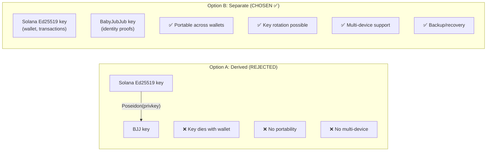
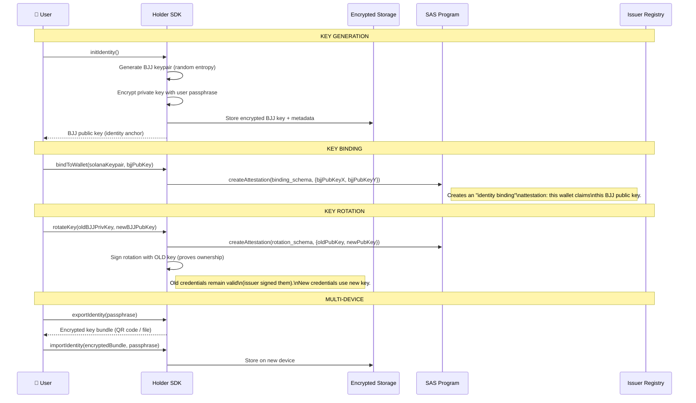
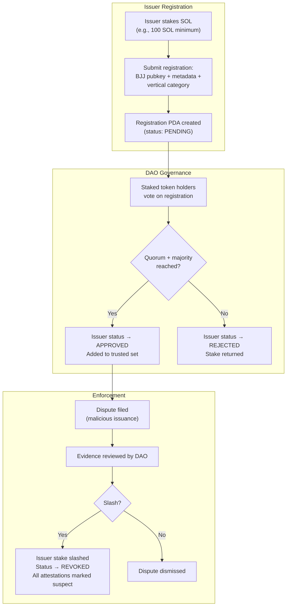
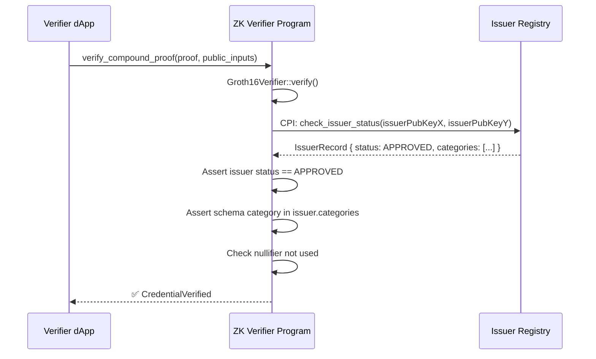
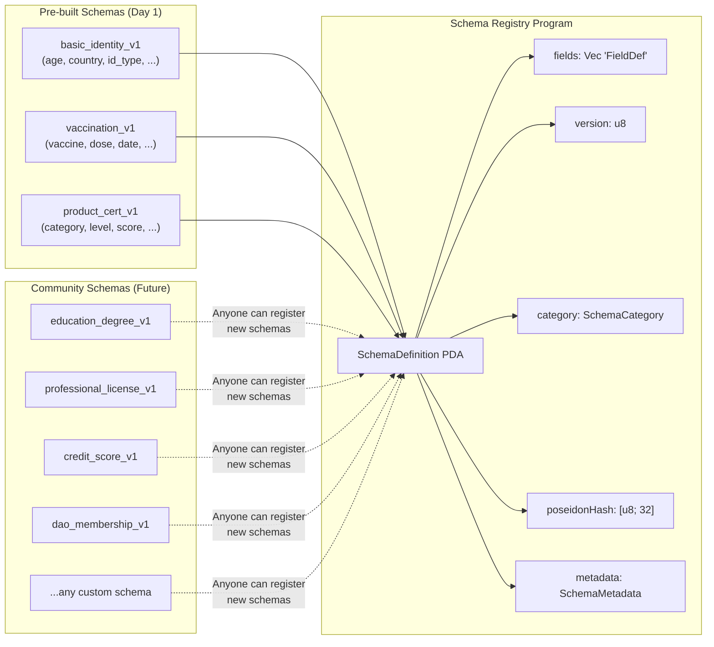
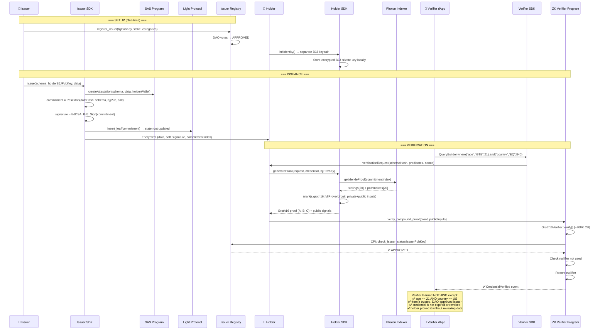
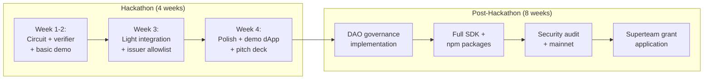
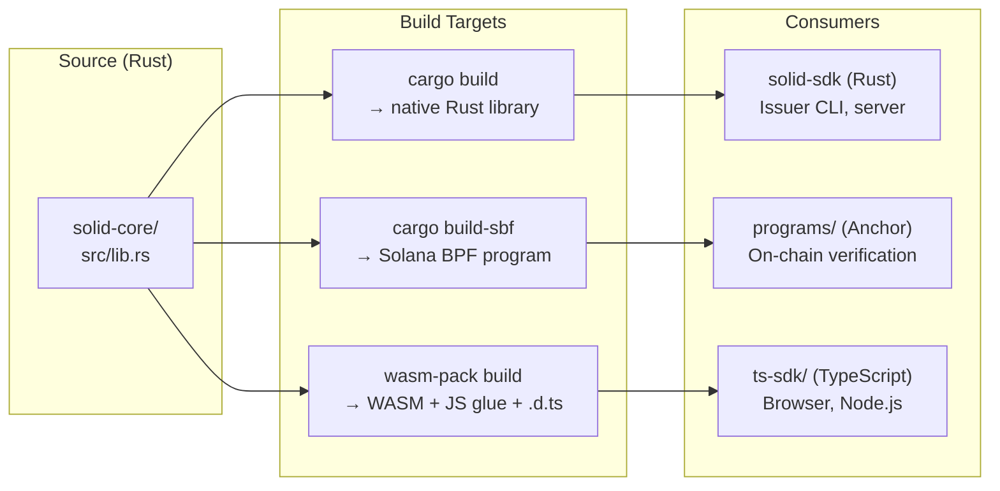

# SolID Protocol — System Architecture

> **Private Onchain Identity Infrastructure for Solana**
> SAS + ZK Compound Queries + Light Compression + DAO Trust Registry

> [!NOTE]
> This document is the technical blueprint. It incorporates all finalized decisions from the [deep dive](file:///C:/Users/KIIT/.gemini/antigravity/brain/eb59111f-985d-4b4a-9a39-eb82b8c0c7e7/private_onchain_identity_deep_dive.md):
> separate BabyJubJub key management, compound AND/OR queries, DAO-governed issuer registry, modular schema verticals, hackathon-first strategy.
>
> **Tech Stack**: Rust-first. Core crypto crate compiled to **WASM** for browser. TypeScript SDK is a thin wrapper over WASM. On-chain programs in Rust/Anchor. Circuits in Circom.

---

## 1. High-Level System Architecture

```mermaid
graph TB
    subgraph "Layer 4: Applications (Verticals)"
        APP1["🏥 Healthcare dApp"]
        APP2["🏨 Hospitality dApp"]
        APP3["📦 Supply Chain dApp"]
        APP4["🏦 DeFi dApp"]
        APP5["... any future vertical"]
    end

    subgraph "Layer 3: SDK Layer"
        SDK_CORE["solid-core (Rust crate)\nPoseidon, BJJ, commitments\n→ compiles to WASM"]
        SDK_RS["Rust SDK\n(Issuer CLI + server-side)"]
        SDK_TS["TypeScript SDK\n(thin wrapper over WASM\n+ @solana/web3.js glue)"]
        SDK_WASM["WASM Module\n(solid-core compiled\nfor browser/Node.js)"]
    end

    subgraph "Layer 2: Protocol Programs (On-chain)"
        ZKV["ZK Verifier Program\n(Groth16 verification +\nnullifier registry)"]
        DAO["Issuer Trust Registry\n(DAO-governed +\nstaking + voting)"]
        SCHEMA["Schema Registry\n(Modular vertical schemas)"]
    end

    subgraph "Layer 1: Foundation (Existing Infra)"
        SAS["Solana Attestation Service\n(Credential + Schema + Attestation PDAs)"]
        LIGHT["Light Protocol\n(ZK Compressed state trees)"]
        GROTH["groth16-solana\n(alt_bn128 native syscalls)"]
    end

    subgraph "Layer 0: Cryptographic Primitives"
        CIRCOM["Circom Circuits\n(credentialCompoundQuerySolana)"]
        POSEIDON["Poseidon Hash\n(SNARK-friendly)"]
        BJJ["BabyJubJub\n(EdDSA signatures)"]
        SMT["Sparse Merkle Tree\n(Inclusion/exclusion proofs)"]
    end

    APP1 & APP2 & APP3 & APP4 & APP5 --> SDK_TS
    APP1 & APP2 & APP3 & APP4 & APP5 --> SDK_RS

    SDK_CORE --> SDK_WASM
    SDK_CORE --> SDK_RS
    SDK_WASM --> SDK_TS

    SDK_RS --> SAS
    SDK_RS --> LIGHT
    SDK_RS --> DAO
    SDK_RS --> SCHEMA

    SDK_TS --> SAS
    SDK_TS --> LIGHT
    SDK_TS --> ZKV
    SDK_TS --> DAO

    ZKV --> GROTH
    ZKV --> LIGHT

    DAO --> SAS

    CIRCOM --> POSEIDON & BJJ & SMT
</graph>
```

---

## 2. Module Breakdown

### 2.1 On-Chain Programs (Anchor / Native Solana)

```
programs/
├── zk-verifier/              # Core ZK proof verification
│   ├── src/
│   │   ├── lib.rs            # Program entrypoint
│   │   ├── instructions/
│   │   │   ├── verify_compound_proof.rs   # Main verification instruction
│   │   │   ├── init_nullifier_set.rs      # Per-verifier nullifier init
│   │   │   └── check_nullifier.rs         # Nullifier lookup
│   │   ├── state/
│   │   │   ├── nullifier_set.rs    # Bloom filter for used nullifiers
│   │   │   └── verifying_keys.rs   # Circuit verifying key storage
│   │   └── errors.rs
│   └── Cargo.toml
│
├── issuer-registry/          # DAO-governed trust registry
│   ├── src/
│   │   ├── lib.rs
│   │   ├── instructions/
│   │   │   ├── register_issuer.rs     # Stake + register as issuer
│   │   │   ├── vote_issuer.rs         # DAO vote to approve/remove
│   │   │   ├── slash_issuer.rs        # Slash malicious issuer stake
│   │   │   ├── revoke_issuer.rs       # Remove from trusted set
│   │   │   └── update_issuer.rs       # Update issuer metadata
│   │   ├── state/
│   │   │   ├── issuer_record.rs       # Issuer PDA with BJJ pubkey
│   │   │   ├── registry_config.rs     # DAO parameters
│   │   │   └── vote_record.rs         # Governance votes
│   │   └── errors.rs
│   └── Cargo.toml
│
├── schema-registry/          # Modular schema management
│   ├── src/
│   │   ├── lib.rs
│   │   ├── instructions/
│   │   │   ├── register_schema.rs     # Create new schema (any vertical)
│   │   │   ├── deprecate_schema.rs    # Mark schema as deprecated
│   │   │   └── query_schema.rs        # Read schema definition
│   │   ├── state/
│   │   │   ├── schema_definition.rs   # Field names, types, constraints
│   │   │   └── schema_version.rs      # Versioning
│   │   └── errors.rs
│   └── Cargo.toml
```

### 2.2 Circuits (Circom)

```
circuits/
├── lib/                      # Shared sub-circuits
│   ├── credential_hasher.circom       # Poseidon commitment computation
│   ├── ownership_verifier.circom      # BJJ key ownership proof
│   ├── signature_verifier.circom      # Issuer EdDSA verification
│   ├── merkle_inclusion.circom        # Light Protocol tree inclusion
│   ├── expiration_checker.circom      # Temporal validity
│   ├── field_selector.circom          # Private field MUX
│   ├── predicate_evaluator.circom     # Single predicate (op + value)
│   └── nullifier_computer.circom      # Nullifier generation
│
├── compound_query.circom     # Main circuit: AND/OR compound queries
├── single_query.circom       # Lightweight: single predicate (fallback)
│
├── trusted_setup/
│   ├── powersoftau/          # Phase 1 ceremony artifacts
│   └── phase2/               # Circuit-specific Phase 2
│
├── build/                    # Compiled outputs
│   ├── compound_query.r1cs
│   ├── compound_query.wasm
│   ├── compound_query.zkey
│   └── verification_key.json
│
└── test/
    ├── compound_query.test.js
    └── test_vectors/
```

### 2.3 Rust Core Crate (`solid-core`) — Single Source of Truth

This is the heart of the protocol. **One Rust crate** for all cryptographic operations, shared between:
- On-chain programs (imported as a workspace dependency)
- Rust SDK (native, for issuer servers and CLI)
- WASM module (compiled via `wasm-pack`, consumed by TypeScript SDK)

```
crates/
├── solid-core/                       # 🔑 THE core crate
│   ├── src/
│   │   ├── lib.rs                    # Re-exports
│   │   ├── poseidon.rs               # SNARK-compatible Poseidon hash
│   │   ├── babyjubjub.rs             # BJJ key gen, sign, verify
│   │   ├── commitment.rs             # Attestation commitment builder
│   │   ├── nullifier.rs              # Nullifier computation
│   │   ├── schema.rs                 # Schema hash computation
│   │   ├── query.rs                  # Query types + compound logic
│   │   ├── credential.rs             # Credential types + serialization
│   │   ├── merkle.rs                 # Merkle proof types (Light-compatible)
│   │   └── wasm.rs                   # #[wasm_bindgen] exports (feature-gated)
│   ├── Cargo.toml                    # features = ["wasm", "solana-program"]
│   └── tests/
│
├── solid-sdk/                        # Rust SDK (issuer CLI, server-side)
│   ├── src/
│   │   ├── lib.rs
│   │   ├── issuer.rs                 # create_credential, revoke, sign
│   │   ├── holder.rs                 # proof input preparation
│   │   ├── verifier.rs               # submit proof, check issuer
│   │   ├── light.rs                  # Light Protocol integration
│   │   ├── sas.rs                    # SAS SDK wrapper
│   │   └── key_store.rs              # Encrypted BJJ key storage
│   └── Cargo.toml
│
└── solid-cli/                        # CLI tool (uses solid-sdk)
    ├── src/
    │   ├── main.rs
    │   ├── commands/
    │   │   ├── init_identity.rs       # Generate BJJ keypair
    │   │   ├── issue.rs               # Issue credential
    │   │   ├── prove.rs               # Generate proof (calls snarkjs via subprocess)
    │   │   ├── verify.rs              # Submit proof on-chain
    │   │   └── schema.rs              # Register/query schemas
    │   └── config.rs
    └── Cargo.toml
```

### 2.4 WASM Module (`solid-wasm`)

Compiled from `solid-core` with `wasm-pack`. Exposes all crypto functions to JavaScript/TypeScript.

```
wasm/
├── Cargo.toml                        # depends on solid-core with feature = "wasm"
├── src/
│   └── lib.rs                        # #[wasm_bindgen] bridge functions
├── pkg/                              # wasm-pack output (auto-generated)
│   ├── solid_wasm.js                 # JS glue code
│   ├── solid_wasm_bg.wasm            # Compiled WASM binary
│   ├── solid_wasm.d.ts               # TypeScript type definitions
│   └── package.json                  # npm-publishable
└── tests/
    └── web.rs                        # wasm-bindgen-test
```

### 2.5 TypeScript SDK (Thin Wrapper over WASM)

The TS SDK does NOT reimplement crypto. It imports the WASM module and adds:
- `@solana/web3.js` transaction building
- snarkjs proof generation orchestration
- Photon Indexer API calls
- Ergonomic `QueryBuilder` DSL

```
ts-sdk/
├── packages/
│   ├── core/                 # Imports solid-wasm, re-exports typed API
│   │   ├── src/
│   │   │   ├── index.ts
│   │   │   ├── wasm-loader.ts        # Dynamic WASM module loading
│   │   │   ├── types.ts              # TypeScript types (mirror Rust types)
│   │   │   └── utils.ts              # Hex encoding, serialization helpers
│   │   └── package.json              # depends on solid-wasm npm pkg
│   │
│   ├── issuer/               # Issuer SDK (wraps WASM + web3.js)
│   │   ├── src/
│   │   │   ├── create_credential.ts  # SAS issuance + Light commitment
│   │   │   ├── revoke_credential.ts  # Light tree nullification
│   │   │   ├── key_management.ts     # BJJ key gen/import/export (via WASM)
│   │   │   └── index.ts
│   │   └── package.json
│   │
│   ├── holder/               # Holder SDK (proof generation)
│   │   ├── src/
│   │   │   ├── prove.ts              # snarkjs + WASM for input preparation
│   │   │   ├── credential_store.ts   # Encrypted IndexedDB/localStorage
│   │   │   ├── key_manager.ts        # BJJ private key management (via WASM)
│   │   │   ├── merkle_fetcher.ts     # Photon Indexer integration
│   │   │   └── index.ts
│   │   └── package.json
│   │
│   └── verifier/             # Verifier SDK
│       ├── src/
│       │   ├── verify.ts             # Submit proof to on-chain program
│       │   ├── query_builder.ts      # Compound query DSL
│       │   ├── issuer_check.ts       # Check issuer in DAO registry
│       │   └── index.ts
│       └── package.json
│
└── package.json              # Monorepo root (turborepo)
```

---

## 3. Compound Query Circuit — Full Design

> [!IMPORTANT]
> This is the upgraded circuit from the deep dive. It supports **up to `MAX_PREDICATES` (default: 4) compound predicates** combined with AND/OR logic in a single proof.

### 3.1 Signal Architecture

```mermaid
graph TB
    subgraph "Private Inputs"
        direction LR
        P1["attestationData[8]"]
        P2["issuerSig (Rx,Ry,S)"]
        P3["holderBJJPrivKey"]
        P4["holderBJJPubKey (X,Y)"]
        P5["merkleSiblings[20]"]
        P6["merklePathIndices[20]"]
        P7["attestationSalt"]
    end

    subgraph "Public Inputs"
        direction LR
        Q1["merkleRoot"]
        Q2["issuerPubKey (X,Y)"]
        Q3["schemaHash"]
        Q4["queryFieldIndices[4]"]
        Q5["queryOperators[4]"]
        Q6["queryValues[4]"]
        Q7["numPredicates (1-4)"]
        Q8["compoundLogic\n(0=AND, 1=OR)"]
        Q9["expirationTimestamp"]
        Q10["currentTimestamp"]
        Q11["verifierNonce"]
    end

    subgraph "Public Outputs"
        direction LR
        O1["nullifierHash"]
        O2["valid (0 or 1)"]
        O3["disclosedValues[4]"]
    end

    P1 & P2 & P3 & P4 & P5 & P6 & P7 --> CIRCUIT["credentialCompoundQuerySolana"]
    Q1 & Q2 & Q3 & Q4 & Q5 & Q6 & Q7 & Q8 & Q9 & Q10 & Q11 --> CIRCUIT
    CIRCUIT --> O1 & O2 & O3
```



### 3.2 The Compound Circuit

```circom
pragma circom 2.1.0;

include "circomlib/circuits/poseidon.circom";
include "circomlib/circuits/comparators.circom";
include "circomlib/circuits/babyjub.circom";
include "circomlib/circuits/eddsaposeidon.circom";
include "circomlib/circuits/bitify.circom";
include "circomlib/circuits/smt/smtverifier.circom";

// ============================================================
// PredicateEvaluator
// ============================================================
// Evaluates a single predicate: selectedValue <op> queryValue
// Returns 1 if predicate passes, 0 otherwise.
// op=0 is NOOP (selective disclosure, always passes).
// ============================================================
template PredicateEvaluator() {
    signal input selectedValue;
    signal input queryOperator;    // 0=NOOP, 1=EQ, 2=NE, 3=GT, 4=GTE, 5=LT, 6=LTE
    signal input queryValue;
    signal output result;
    signal output disclosed;       // selectedValue if NOOP, else 0

    // Compute all comparison results
    component isEq = IsEqual();
    isEq.in[0] <== selectedValue;
    isEq.in[1] <== queryValue;

    component isGt = GreaterThan(252);
    isGt.in[0] <== selectedValue;
    isGt.in[1] <== queryValue;

    component isLt = LessThan(252);
    isLt.in[0] <== selectedValue;
    isLt.in[1] <== queryValue;

    signal isNe;
    isNe <== 1 - isEq.out;

    signal isGte;
    isGte <== isGt.out + isEq.out - isGt.out * isEq.out;

    signal isLte;
    isLte <== isLt.out + isEq.out - isLt.out * isEq.out;

    // MUX to select result based on operator
    signal opResults[7];
    opResults[0] <== 1;         // NOOP
    opResults[1] <== isEq.out;  // EQ
    opResults[2] <== isNe;      // NE
    opResults[3] <== isGt.out;  // GT
    opResults[4] <== isGte;     // GTE
    opResults[5] <== isLt.out;  // LT
    opResults[6] <== isLte;     // LTE

    component opEquals[7];
    signal opProducts[7];
    for (var i = 0; i < 7; i++) {
        opEquals[i] = IsEqual();
        opEquals[i].in[0] <== queryOperator;
        opEquals[i].in[1] <== i;
        opProducts[i] <== opResults[i] * opEquals[i].out;
    }

    signal opPartialSums[7];
    opPartialSums[0] <== opProducts[0];
    for (var i = 1; i < 7; i++) {
        opPartialSums[i] <== opPartialSums[i-1] + opProducts[i];
    }
    result <== opPartialSums[6];

    // Selective disclosure: reveal value only if NOOP
    component isNoop = IsEqual();
    isNoop.in[0] <== queryOperator;
    isNoop.in[1] <== 0;
    disclosed <== selectedValue * isNoop.out;
}

// ============================================================
// FieldSelector
// ============================================================
// Private MUX: selects attestationData[fieldIndex]
// without revealing which field was selected.
// ============================================================
template FieldSelector(NUM_FIELDS) {
    signal input attestationData[NUM_FIELDS];
    signal input fieldIndex;
    signal output selectedValue;

    component fieldEquals[NUM_FIELDS];
    signal products[NUM_FIELDS];

    for (var i = 0; i < NUM_FIELDS; i++) {
        fieldEquals[i] = IsEqual();
        fieldEquals[i].in[0] <== fieldIndex;
        fieldEquals[i].in[1] <== i;
        products[i] <== attestationData[i] * fieldEquals[i].out;
    }

    signal partialSums[NUM_FIELDS];
    partialSums[0] <== products[0];
    for (var i = 1; i < NUM_FIELDS; i++) {
        partialSums[i] <== partialSums[i-1] + products[i];
    }
    selectedValue <== partialSums[NUM_FIELDS - 1];
}

// ============================================================
// credentialCompoundQuerySolana
// ============================================================
// The main circuit. Supports up to MAX_PREDICATES compound
// predicates combined with AND or OR logic.
//
// Key design decisions:
//   - Separate BJJ key management (NOT derived from Ed25519)
//   - Compound AND/OR over up to 4 predicates
//   - Modular: sub-circuits are reusable templates
//   - Unused predicates (index >= numPredicates) are auto-true
//
// Estimated constraint count:
//   Base (ownership + sig + merkle + expiry + nullifier): ~16K
//   Per predicate (field MUX + evaluator): ~700
//   Total for 4 predicates: ~19K constraints
// ============================================================
template CredentialCompoundQuerySolana(TREE_DEPTH, NUM_FIELDS, MAX_PREDICATES) {

    // ========================================
    // PRIVATE INPUTS
    // ========================================
    signal input attestationData[NUM_FIELDS];
    signal input issuerSigRx;
    signal input issuerSigRy;
    signal input issuerSigS;

    // Separately managed BJJ private key (NOT derived from Solana wallet)
    signal input holderBJJPrivKey;
    signal input holderBJJPubKeyX;
    signal input holderBJJPubKeyY;

    signal input merkleSiblings[TREE_DEPTH];
    signal input merklePathIndices[TREE_DEPTH];
    signal input attestationSalt;

    // ========================================
    // PUBLIC INPUTS
    // ========================================
    signal input merkleRoot;
    signal input issuerPubKeyX;
    signal input issuerPubKeyY;
    signal input schemaHash;

    // Compound query: up to MAX_PREDICATES predicates
    signal input queryFieldIndices[MAX_PREDICATES];
    signal input queryOperators[MAX_PREDICATES];
    signal input queryValues[MAX_PREDICATES];
    signal input numPredicates;     // How many predicates are active (1..MAX_PREDICATES)
    signal input compoundLogic;     // 0 = AND (all must pass), 1 = OR (any must pass)

    signal input expirationTimestamp;
    signal input currentTimestamp;
    signal input verifierNonce;

    // ========================================
    // PUBLIC OUTPUTS
    // ========================================
    signal output nullifierHash;
    signal output valid;
    signal output disclosedValues[MAX_PREDICATES];

    // ========================================
    // STEP 1: BJJ Key Ownership (Separate Key)
    // ========================================
    // The holder has a separately-managed BabyJubJub key pair.
    // We verify the private key matches the claimed public key.
    // The public key is embedded in the attestation commitment.

    component holderKeyDerivation = BabyPbk();
    holderKeyDerivation.in <== holderBJJPrivKey;
    holderKeyDerivation.Ax === holderBJJPubKeyX;
    holderKeyDerivation.Ay === holderBJJPubKeyY;

    // ========================================
    // STEP 2: Attestation Commitment
    // ========================================
    component dataHash = Poseidon(NUM_FIELDS);
    for (var i = 0; i < NUM_FIELDS; i++) {
        dataHash.inputs[i] <== attestationData[i];
    }

    component attestationCommitment = Poseidon(5);
    attestationCommitment.inputs[0] <== dataHash.out;
    attestationCommitment.inputs[1] <== schemaHash;
    attestationCommitment.inputs[2] <== holderBJJPubKeyX;
    attestationCommitment.inputs[3] <== holderBJJPubKeyY;
    attestationCommitment.inputs[4] <== attestationSalt;

    // ========================================
    // STEP 3: Issuer Signature Verification
    // ========================================
    component sigVerifier = EdDSAPoseidonVerifier();
    sigVerifier.enabled <== 1;
    sigVerifier.Ax <== issuerPubKeyX;
    sigVerifier.Ay <== issuerPubKeyY;
    sigVerifier.R8x <== issuerSigRx;
    sigVerifier.R8y <== issuerSigRy;
    sigVerifier.S <== issuerSigS;
    sigVerifier.M <== attestationCommitment.out;

    // ========================================
    // STEP 4: Merkle Inclusion (Light Protocol)
    // ========================================
    component merkleVerifier = SMTVerifier(TREE_DEPTH);
    merkleVerifier.enabled <== 1;
    merkleVerifier.root <== merkleRoot;
    merkleVerifier.siblings <== merkleSiblings;
    merkleVerifier.oldKey <== 0;
    merkleVerifier.oldValue <== 0;
    merkleVerifier.isOld0 <== 0;
    merkleVerifier.key <== attestationCommitment.out;
    merkleVerifier.value <== attestationCommitment.out;
    merkleVerifier.fnc <== 0;

    // ========================================
    // STEP 5: Expiration Check
    // ========================================
    component expiryCheck = GreaterThan(64);
    expiryCheck.in[0] <== expirationTimestamp;
    expiryCheck.in[1] <== currentTimestamp;

    component isNoExpiry = IsZero();
    isNoExpiry.in <== expirationTimestamp;

    signal expiryValid;
    expiryValid <== isNoExpiry.out + expiryCheck.out - isNoExpiry.out * expiryCheck.out;
    expiryValid === 1;

    // ========================================
    // STEP 6: Compound Predicate Evaluation
    // ========================================
    // For each predicate slot (0..MAX_PREDICATES-1):
    //   - Select the field from attestationData
    //   - Evaluate the predicate
    //   - If slot >= numPredicates, auto-pass (inactive predicate)
    //
    // Then combine results:
    //   AND mode (compoundLogic=0): ALL active predicates must pass
    //   OR mode  (compoundLogic=1): ANY active predicate must pass

    component fieldSelectors[MAX_PREDICATES];
    component predicateEvals[MAX_PREDICATES];
    component isActive[MAX_PREDICATES];
    signal predicateResults[MAX_PREDICATES];

    for (var i = 0; i < MAX_PREDICATES; i++) {
        // Select the field value for this predicate
        fieldSelectors[i] = FieldSelector(NUM_FIELDS);
        for (var j = 0; j < NUM_FIELDS; j++) {
            fieldSelectors[i].attestationData[j] <== attestationData[j];
        }
        fieldSelectors[i].fieldIndex <== queryFieldIndices[i];

        // Evaluate the predicate
        predicateEvals[i] = PredicateEvaluator();
        predicateEvals[i].selectedValue <== fieldSelectors[i].selectedValue;
        predicateEvals[i].queryOperator <== queryOperators[i];
        predicateEvals[i].queryValue <== queryValues[i];

        // Check if this predicate slot is active
        isActive[i] = LessThan(8);  // numPredicates fits in 3 bits
        isActive[i].in[0] <== i;
        isActive[i].in[1] <== numPredicates;

        // If active: use actual result. If inactive: default to 1 (pass).
        predicateResults[i] <== isActive[i].out * predicateEvals[i].result
                              + (1 - isActive[i].out) * 1;

        // Disclosed values
        disclosedValues[i] <== predicateEvals[i].disclosed * isActive[i].out;
    }

    // ========================================
    // STEP 7: Compound Logic (AND / OR)
    // ========================================
    // AND mode: product of all results must be 1
    // OR mode: sum of all results must be >= 1

    // Compute AND (product of all results)
    signal andAccum[MAX_PREDICATES];
    andAccum[0] <== predicateResults[0];
    for (var i = 1; i < MAX_PREDICATES; i++) {
        andAccum[i] <== andAccum[i-1] * predicateResults[i];
    }
    signal andResult;
    andResult <== andAccum[MAX_PREDICATES - 1];

    // Compute OR (at least one result is 1)
    signal orSum[MAX_PREDICATES];
    orSum[0] <== predicateResults[0];
    for (var i = 1; i < MAX_PREDICATES; i++) {
        orSum[i] <== orSum[i-1] + predicateResults[i];
    }
    // OR passes if sum > 0 → use IsZero inverted
    component orCheck = IsZero();
    orCheck.in <== orSum[MAX_PREDICATES - 1];
    signal orResult;
    orResult <== 1 - orCheck.out; // 1 if any passed, 0 if none

    // MUX between AND and OR based on compoundLogic
    component logicIsOr = IsEqual();
    logicIsOr.in[0] <== compoundLogic;
    logicIsOr.in[1] <== 1;

    signal compoundResult;
    compoundResult <== andResult * (1 - logicIsOr.out) + orResult * logicIsOr.out;

    // Constraint: compound query must pass
    compoundResult === 1;

    // ========================================
    // STEP 8: Nullifier
    // ========================================
    component nullifier = Poseidon(3);
    nullifier.inputs[0] <== holderBJJPrivKey;
    nullifier.inputs[1] <== schemaHash;
    nullifier.inputs[2] <== verifierNonce;
    nullifierHash <== nullifier.out;

    // ========================================
    // OUTPUT
    // ========================================
    valid <== 1;
}

// ============================================================
// MAIN COMPONENT
// ============================================================
// TREE_DEPTH = 20  → up to ~1M credentials per tree
// NUM_FIELDS = 8   → up to 8 fields per schema
// MAX_PREDICATES = 4 → up to 4 compound predicates per proof
//
// Estimated total: ~19,000 constraints
// Proof generation: ~3-4 seconds (browser WASM)
// On-chain verification: ~200K compute units
// ============================================================
component main {public [
    merkleRoot,
    issuerPubKeyX,
    issuerPubKeyY,
    schemaHash,
    queryFieldIndices,
    queryOperators,
    queryValues,
    numPredicates,
    compoundLogic,
    expirationTimestamp,
    currentTimestamp,
    verifierNonce
]} = CredentialCompoundQuerySolana(20, 8, 4);
```

### 3.3 Constraint Budget (Compound Circuit)

| Component | Constraints | Count | Subtotal |
|---|---|---|---|
| BabyPbk (key derivation) | ~500 | ×1 | 500 |
| Poseidon (8-input data hash) | ~2,400 | ×1 | 2,400 |
| Poseidon (5-input commitment) | ~1,500 | ×1 | 1,500 |
| EdDSAPoseidonVerifier | ~5,000 | ×1 | 5,000 |
| SMTVerifier (depth 20) | ~6,000 | ×1 | 6,000 |
| Expiry check (64-bit) | ~200 | ×1 | 200 |
| FieldSelector (8 fields) | ~200 | ×4 | 800 |
| PredicateEvaluator (7 ops) | ~500 | ×4 | 2,000 |
| Active slot check | ~20 | ×4 | 80 |
| Compound AND/OR logic | ~100 | ×1 | 100 |
| Poseidon nullifier | ~900 | ×1 | 900 |
| **Total** | | | **~19,480** |

> [!TIP]
> 19.5K constraints is well within Groth16 feasibility.  
> - **Proof gen**: ~3-4 seconds (snarkjs WASM in browser)  
> - **On-chain verification**: ~200K compute units (native `alt_bn128` syscalls)  
> - **Cost**: fraction of a cent per verification on Solana

---

## 4. BabyJubJub Key Management — Separate Key Architecture

### 4.1 Why Separate Keys



### 4.2 Key Lifecycle



### 4.3 Key Storage Format (Rust — `solid-core`)

```rust
// crates/solid-core/src/babyjubjub.rs

use serde::{Deserialize, Serialize};

/// Portable BJJ identity bundle.
/// Serialized to JSON/MessagePack for storage and cross-device export.
/// The TS SDK accesses this via WASM deserialization — no reimplementation needed.
#[derive(Serialize, Deserialize, Clone, Debug)]
pub struct BJJIdentity {
    pub version: u8,  // Currently 1
    pub public_key: BJJPublicKey,
    pub encrypted_private_key: EncryptedKey,
    pub metadata: IdentityMetadata,
}

#[derive(Serialize, Deserialize, Clone, Debug)]
pub struct BJJPublicKey {
    /// BabyJubJub X coordinate (32 bytes, big-endian)
    pub x: [u8; 32],
    /// BabyJubJub Y coordinate (32 bytes, big-endian)
    pub y: [u8; 32],
}

#[derive(Serialize, Deserialize, Clone, Debug)]
pub struct EncryptedKey {
    /// AES-256-GCM encrypted private key
    pub ciphertext: Vec<u8>,
    /// 12-byte nonce for AES-256-GCM
    pub nonce: [u8; 12],
    /// Argon2id salt for passphrase → encryption key derivation
    pub salt: [u8; 32],
}

#[derive(Serialize, Deserialize, Clone, Debug)]
pub struct IdentityMetadata {
    /// Unix timestamp of identity creation
    pub created_at: u64,
    /// Solana wallet pubkeys bound to this BJJ identity
    pub wallet_bindings: Vec<[u8; 32]>,
    /// Previous BJJ public key if this identity was rotated
    pub rotated_from: Option<BJJPublicKey>,
}

impl BJJIdentity {
    /// Generate a new identity with a fresh BJJ keypair.
    /// Private key is encrypted with the given passphrase via Argon2id + AES-256-GCM.
    pub fn generate(passphrase: &[u8]) -> Result<Self, CryptoError> {
        let keypair = generate_keypair()?;
        let salt = generate_random_salt();
        let encryption_key = argon2id_derive(passphrase, &salt)?;
        let (ciphertext, nonce) = aes256gcm_encrypt(&keypair.private_key, &encryption_key)?;

        Ok(Self {
            version: 1,
            public_key: keypair.public_key,
            encrypted_private_key: EncryptedKey { ciphertext, nonce, salt },
            metadata: IdentityMetadata {
                created_at: current_unix_timestamp(),
                wallet_bindings: vec![],
                rotated_from: None,
            },
        })
    }

    /// Decrypt and return the BJJ private key.
    pub fn unlock(&self, passphrase: &[u8]) -> Result<[u8; 32], CryptoError> {
        let encryption_key = argon2id_derive(passphrase, &self.encrypted_private_key.salt)?;
        aes256gcm_decrypt(
            &self.encrypted_private_key.ciphertext,
            &self.encrypted_private_key.nonce,
            &encryption_key,
        )
    }

    /// Export as JSON string for cross-device transfer.
    pub fn export_json(&self) -> Result<String, serde_json::Error> {
        serde_json::to_string_pretty(self)
    }

    /// Import from JSON string.
    pub fn import_json(json: &str) -> Result<Self, serde_json::Error> {
        serde_json::from_str(json)
    }
}
```

---

## 5. DAO-Governed Issuer Trust Registry

### 5.1 Architecture



### 5.2 Issuer Record PDA

```rust
#[account]
pub struct IssuerRecord {
    /// The issuer's Solana authority wallet
    pub authority: Pubkey,

    /// The issuer's BabyJubJub public key (used in circuit verification)
    pub bjj_pub_key_x: [u8; 32],
    pub bjj_pub_key_y: [u8; 32],

    /// Human-readable issuer name (max 64 bytes)
    pub name: String,

    /// Issuer category (which verticals they can issue for)
    pub categories: Vec<SchemaCategory>,

    /// Status: Pending(0), Approved(1), Suspended(2), Revoked(3)
    pub status: u8,

    /// SOL staked as collateral
    pub staked_lamports: u64,

    /// Governance metadata
    pub registered_at: i64,
    pub approved_at: Option<i64>,
    pub votes_for: u32,
    pub votes_against: u32,

    /// Bump seed for PDA derivation
    pub bump: u8,
}

#[derive(AnchorSerialize, AnchorDeserialize, Clone, PartialEq)]
pub enum SchemaCategory {
    Healthcare,
    Hospitality,
    SupplyChain,
    Finance,
    Education,
    Government,
    Custom(String),
}
```

### 5.3 Verification Flow with Registry Check



---

## 6. Modular Schema Registry

### 6.1 Design — Any Vertical, Anytime



### 6.2 Schema Definition

```rust
#[account]
pub struct SchemaDefinition {
    /// Unique schema name (max 32 bytes, used in PDA seed)
    pub name: String,

    /// Schema version (0-255, used in PDA seed)
    pub version: u8,

    /// Category for this schema
    pub category: SchemaCategory,

    /// Field definitions (up to 8 for current circuit)
    pub fields: Vec<FieldDef>,

    /// Poseidon hash of the schema (used in circuits)
    pub schema_hash: [u8; 32],

    /// Creator authority
    pub creator: Pubkey,

    /// Whether this schema is deprecated
    pub deprecated: bool,

    /// Reference to corresponding SAS schema PDA (optional integration)
    pub sas_schema_pda: Option<Pubkey>,

    pub bump: u8,
}

#[derive(AnchorSerialize, AnchorDeserialize, Clone)]
pub struct FieldDef {
    /// Field name (max 32 bytes)
    pub name: String,

    /// Field type (currently all u64 for circuit compatibility)
    pub field_type: FieldType,

    /// Whether this field supports range queries
    pub range_queryable: bool,

    /// Human-readable description
    pub description: String,
}

#[derive(AnchorSerialize, AnchorDeserialize, Clone)]
pub enum FieldType {
    Uint64,         // Standard numeric
    Boolean,        // 0 or 1
    Enum(Vec<String>), // Named enum variants (stored as u64 index)
    Timestamp,      // Unix timestamp (u64)
}
```

### 6.3 Adding a New Vertical (Developer Experience)

```typescript
import { SchemaRegistry } from "@solid-protocol/sdk";

// Any developer can register a new schema for any vertical
const educationSchema = await SchemaRegistry.register({
    name: "university_degree_v1",
    category: "Education",
    fields: [
        { name: "degree_type",     type: "Enum", values: ["Bachelor", "Master", "PhD", "Associate"] },
        { name: "graduation_year", type: "Uint64" },
        { name: "gpa_x100",       type: "Uint64",  description: "GPA × 100 (e.g., 385 = 3.85)" },
        { name: "institution_id",  type: "Uint64" },
        { name: "major_code",      type: "Uint64" },
        { name: "accredited",      type: "Boolean" },
        { name: "country_code",    type: "Uint64" },
        { name: "_reserved",       type: "Uint64" },
    ],
});

// Now any approved issuer in the Education category can issue
// attestations against this schema, and any verifier can request
// ZK proofs against it:
const query = queryBuilder
    .schema(educationSchema.hash)
    .where("degree_type", "EQ", 2)      // PhD
    .and("gpa_x100", "GTE", 350)        // GPA >= 3.50
    .and("accredited", "EQ", 1)         // Must be accredited
    .build();
```

---

## 7. SDK — Query Builder DSL

### 7.1 TypeScript API (Verifier Side)

```typescript
import { SolidVerifier, QueryBuilder } from "@solid-protocol/verifier";

// Fluent API for building compound queries
const query = new QueryBuilder()
    .schema("basic_identity_v1")
    .where("age", "GTE", 21)
    .and("country_code", "EQ", 840)     // US = 840 (ISO 3166-1)
    .withNonce("unique-session-id-12345")
    .build();

// query produces:
// {
//   schemaHash: "0x...",
//   predicates: [
//     { fieldIndex: 0, operator: 4, value: 21 },  // age >= 21
//     { fieldIndex: 1, operator: 1, value: 840 },  // country == US
//   ],
//   numPredicates: 2,
//   compoundLogic: 0,  // AND
//   verifierNonce: "0x...",
// }

// Send to holder for proof generation
const verificationRequest = SolidVerifier.createRequest(query);
```

### 7.2 TypeScript API (Holder Side)

```typescript
import { SolidHolder } from "@solid-protocol/holder";

// Holder receives the verification request
const proof = await SolidHolder.generateProof({
    request: verificationRequest,
    credential: myStoredCredential,  // Encrypted local storage
    bjjPrivateKey: await keyManager.unlock("my-passphrase"),
    // SDK automatically:
    //   1. Fetches Merkle proof from Photon Indexer
    //   2. Loads the WASM circuit
    //   3. Runs snarkjs.groth16.fullProve()
    //   4. Returns the proof + public inputs
});

// Submit proof on-chain
const tx = await SolidHolder.submitProof(proof, {
    connection,
    payer: walletKeypair,
});
// tx contains: CredentialVerified event on success
```

### 7.3 TypeScript API (Issuer Side)

```typescript
import { SolidIssuer } from "@solid-protocol/issuer";

// Issue a credential (SAS + Light Protocol + BJJ signature)
const credential = await SolidIssuer.issue({
    schema: "vaccination_status_v1",
    holderBJJPubKey: { x: "0x...", y: "0x..." },
    data: {
        vaccine_type: 1,        // COVID
        dose_number: 3,
        date_administered: 1711929600,
        issuer_authority: 1,    // CDC
        batch_number: 4821,
        expiry_date: 0,         // No expiry
        country_code: 840,      // US
        recipient_age: 32,
    },
    // SDK automatically:
    //   1. Calls SAS createAttestation
    //   2. Computes Poseidon commitment
    //   3. Signs commitment with issuer's BJJ key
    //   4. Inserts leaf into Light Protocol compressed tree
    //   5. Returns credential bundle for holder
});

// Send credential to holder (encrypted channel)
await SolidIssuer.deliverToHolder(credential, holderWalletPubkey);
```

---

## 8. Full Data Flow — End to End



---

## 9. Repository Structure

```
solid-protocol/                           # "SolID" — Solana Identity
├── README.md
├── LICENSE                               # Apache-2.0 + MIT dual license
├── Cargo.toml                            # Rust workspace root
├── Anchor.toml                           # Anchor configuration
│
├── crates/                               # ═══ RUST CORE ═══
│   ├── solid-core/                       # 🔑 Core crypto (Poseidon, BJJ, commitments)
│   │   ├── src/                          #    Shared by programs + WASM + CLI
│   │   ├── Cargo.toml                    #    features = ["wasm", "solana-program"]
│   │   └── tests/
│   ├── solid-sdk/                        # Rust SDK (issuer server, verifier backend)
│   │   ├── src/
│   │   └── Cargo.toml
│   └── solid-cli/                        # CLI tool
│       ├── src/
│       └── Cargo.toml
│
├── programs/                             # ═══ ON-CHAIN (Anchor/Rust) ═══
│   ├── zk-verifier/                      # Groth16 proof verification
│   │   └── Cargo.toml                    #    depends on solid-core
│   ├── issuer-registry/                  # DAO-governed trust
│   └── schema-registry/                  # Modular schema management
│
├── wasm/                                 # ═══ WASM BUILD ═══
│   ├── Cargo.toml                        # depends on solid-core[wasm]
│   ├── src/lib.rs                        # #[wasm_bindgen] bridge
│   └── pkg/                              # wasm-pack output → npm publishable
│       ├── solid_wasm.js
│       ├── solid_wasm_bg.wasm
│       ├── solid_wasm.d.ts
│       └── package.json
│
├── circuits/                             # ═══ ZK CIRCUITS (Circom) ═══
│   ├── lib/                              # Reusable sub-circuits
│   ├── compound_query.circom             # Main compound circuit
│   ├── single_query.circom               # Lightweight fallback
│   ├── trusted_setup/                    # Ceremony artifacts
│   ├── build/                            # Compiled outputs (.r1cs, .wasm, .zkey)
│   └── test/                             # Circuit tests (Mocha)
│
├── ts-sdk/                               # ═══ TYPESCRIPT SDK ═══
│   ├── packages/
│   │   ├── core/                         # WASM loader + typed re-exports
│   │   │   └── package.json              #    depends on solid-wasm
│   │   ├── issuer/                       # Issuer SDK (WASM + web3.js)
│   │   ├── holder/                       # Holder SDK (snarkjs + WASM)
│   │   └── verifier/                     # Verifier SDK (QueryBuilder DSL)
│   ├── package.json                      # Monorepo root (turborepo)
│   └── tsconfig.json
│
├── app/                                  # ═══ DEMO dApp ═══
│   ├── src/
│   │   ├── pages/
│   │   │   ├── index.tsx                 # Landing page
│   │   │   ├── issue.tsx                 # Issuer dashboard
│   │   │   ├── prove.tsx                 # Holder proof generation
│   │   │   └── verify.tsx                # Verifier portal
│   │   └── components/
│   └── package.json
│
├── schemas/                              # ═══ VERTICAL SCHEMAS ═══
│   ├── basic_identity_v1.json
│   ├── vaccination_v1.json
│   ├── product_certification_v1.json
│   └── README.md                         # How to add new schemas
│
├── docs/                                 # ═══ DOCUMENTATION ═══
│   ├── architecture.md
│   ├── circuits.md
│   ├── key-management.md
│   ├── wasm-integration.md
│   ├── issuer-guide.md
│   └── verifier-guide.md
│
└── tests/
    ├── integration/                      # End-to-end tests (Rust)
    ├── wasm/                             # WASM integration tests
    └── fixtures/                         # Test data
```

---

## 10. Hackathon Strategy

### 10.1 What to Build for the Hackathon

| Priority | Component | Why |
|---|---|---|
| 🔴 P0 | Compound Circom circuit + Groth16 verifier program | **This is the core innovation.** Without this, you're just another SAS wrapper. |
| 🔴 P0 | E2E demo: issue → prove compound query → verify | Judges need to see it work. "Prove age>=21 AND country==US" with no data leakage. |
| 🟡 P1 | Light Protocol integration (compressed tree) | Shows scalability thinking. Big differentiator vs. hackathon competitors. |
| 🟡 P1 | Basic issuer registry (can be multisig for demo, DAO after) | Shows trust model. Can simplify for hackathon, upgrade to DAO for grants. |
| 🟢 P2 | SDK with QueryBuilder DSL | Developer experience matters for judges. |
| 🟢 P2 | Demo dApp (clean UI) | Visual wow factor. |
| ⚪ P3 | Full DAO governance | Post-hackathon, for grant phase. |
| ⚪ P3 | Multi-device key management | Post-hackathon. |

### 10.2 Hackathon → Grant Transition



---

## 11. Naming Candidates

| Name | Rationale |
|---|---|
| **SolID** | **Sol**ana + **ID**entity. Clean, memorable, domain-friendly. |
| **Veridex** | Verifiable + Index. Sounds like infrastructure. |
| **Shadeproof** | Privacy (shade) + ZK (proof). Catchy. |
| **Attestia** | Attestation + IA. Protocol-sounding. |
| **Cloak** | Privacy-first branding. |

> [!NOTE]
> **Recommendation: `SolID`** — it immediately communicates "Solana Identity" and positions you as THE identity infrastructure for the ecosystem. Check domain/npm availability before committing.

---

## 12. Tech Stack Decision — Rust-First + WASM

### 12.1 Why Rust-First

| Concern | Pure TS Approach | Rust-First + WASM (CHOSEN ✅) |
|---|---|---|
| **Crypto correctness** | ❌ Reimplement Poseidon/BJJ in JS (error-prone) | ✅ One Rust implementation, proven correct, shared everywhere |
| **On-chain / off-chain consistency** | ❌ Two implementations (Rust programs + TS client) can diverge | ✅ Same `solid-core` crate imported by programs AND compiled to WASM |
| **Performance** | ❌ JS Poseidon is ~10x slower than Rust/WASM | ✅ Near-native speed for commitment computation, key ops |
| **Security** | ❌ JS crypto libs have weaker audit culture | ✅ Rust's type system + memory safety + auditability |
| **Testing** | ❌ Must test same logic in two languages | ✅ Test once in Rust, works on-chain AND in browser |
| **Developer reach** | ✅ More JS devs | ✅ TS SDK wraps WASM — JS devs use it seamlessly |

### 12.2 Compilation Pipeline



### 12.3 Feature Flags in `solid-core`

```toml
# crates/solid-core/Cargo.toml
[package]
name = "solid-core"
version = "0.1.0"
edition = "2021"

[features]
default = []
# Enable for on-chain program usage (no-std compatible, no alloc-heavy ops)
solana-program = ["dep:solana-program"]
# Enable for WASM compilation (wasm-bindgen exports)
wasm = ["dep:wasm-bindgen", "dep:js-sys", "dep:serde-wasm-bindgen"]
# Enable for native CLI/server usage (full std, file I/O, networking)
native = ["dep:tokio", "dep:reqwest"]

[dependencies]
# Core crypto (always included)
circom-compat = "0.2"            # Poseidon hash (SNARK-compatible)
babyjubjub-rs = "0.1"            # BabyJubJub curve operations
ff = "0.13"                       # Finite field arithmetic
num-bigint = "0.4"                # Big integer support
serde = { version = "1.0", features = ["derive"] }

# Feature-gated
solana-program = { version = "2.0", optional = true }
wasm-bindgen = { version = "0.2", optional = true }
js-sys = { version = "0.3", optional = true }
serde-wasm-bindgen = { version = "0.6", optional = true }
tokio = { version = "1", features = ["full"], optional = true }
reqwest = { version = "0.12", optional = true }
```

### 12.4 WASM Bridge Example

```rust
// wasm/src/lib.rs
use wasm_bindgen::prelude::*;
use solid_core::{poseidon, babyjubjub, commitment, nullifier};

/// Compute Poseidon hash of attestation data fields.
/// Called from TypeScript SDK when building attestation commitments.
#[wasm_bindgen]
pub fn compute_data_hash(fields: &[u64]) -> Result<Vec<u8>, JsError> {
    let hash = poseidon::hash_fields(fields)
        .map_err(|e| JsError::new(&format!("Poseidon hash failed: {}", e)))?;
    Ok(hash.to_bytes().to_vec())
}

/// Compute full attestation commitment.
/// Matches exactly the circuit's commitment computation.
#[wasm_bindgen]
pub fn compute_attestation_commitment(
    data_hash: &[u8],
    schema_hash: &[u8],
    holder_bjj_pub_x: &[u8],
    holder_bjj_pub_y: &[u8],
    salt: &[u8],
) -> Result<Vec<u8>, JsError> {
    let commit = commitment::compute(
        data_hash, schema_hash,
        holder_bjj_pub_x, holder_bjj_pub_y,
        salt,
    ).map_err(|e| JsError::new(&format!("Commitment failed: {}", e)))?;
    Ok(commit.to_bytes().to_vec())
}

/// Generate BabyJubJub keypair (separate from Solana wallet).
/// Returns: { privateKey: Uint8Array, publicKeyX: Uint8Array, publicKeyY: Uint8Array }
#[wasm_bindgen]
pub fn generate_bjj_keypair() -> Result<JsValue, JsError> {
    let keypair = babyjubjub::generate_keypair()
        .map_err(|e| JsError::new(&format!("Key generation failed: {}", e)))?;
    Ok(serde_wasm_bindgen::to_value(&keypair)?)
}

/// Sign an attestation commitment with issuer's BJJ private key.
#[wasm_bindgen]
pub fn sign_commitment(
    private_key: &[u8],
    commitment_hash: &[u8],
) -> Result<JsValue, JsError> {
    let sig = babyjubjub::sign(private_key, commitment_hash)
        .map_err(|e| JsError::new(&format!("Signing failed: {}", e)))?;
    Ok(serde_wasm_bindgen::to_value(&sig)?)
}

/// Compute nullifier hash.
#[wasm_bindgen]
pub fn compute_nullifier(
    holder_private_key: &[u8],
    schema_hash: &[u8],
    verifier_nonce: &[u8],
) -> Result<Vec<u8>, JsError> {
    let null = nullifier::compute(holder_private_key, schema_hash, verifier_nonce)
        .map_err(|e| JsError::new(&format!("Nullifier failed: {}", e)))?;
    Ok(null.to_bytes().to_vec())
}
```

### 12.5 TypeScript Consuming WASM

```typescript
// ts-sdk/packages/core/src/wasm-loader.ts
import init, {
    compute_data_hash,
    compute_attestation_commitment,
    generate_bjj_keypair,
    sign_commitment,
    compute_nullifier,
} from "@solid-protocol/wasm";

let initialized = false;

export async function ensureWasmLoaded(): Promise<void> {
    if (!initialized) {
        await init(); // Loads the .wasm binary
        initialized = true;
    }
}

// Re-export typed wrappers
export {
    compute_data_hash as poseidonHash,
    compute_attestation_commitment as computeCommitment,
    generate_bjj_keypair as generateBJJKeypair,
    sign_commitment as signCommitment,
    compute_nullifier as computeNullifier,
};
```

```typescript
// ts-sdk/packages/holder/src/prove.ts
import { ensureWasmLoaded, poseidonHash, computeCommitment } from "@solid-protocol/core";
import * as snarkjs from "snarkjs";

export async function generateProof(request: VerificationRequest, credential: StoredCredential) {
    await ensureWasmLoaded();

    // 1. Prepare circuit inputs using WASM (same code as on-chain!)
    const dataHash = poseidonHash(credential.fields);
    const commitment = computeCommitment(
        dataHash, request.schemaHash,
        credential.holderBJJPubKeyX, credential.holderBJJPubKeyY,
        credential.salt,
    );

    // 2. Fetch Merkle proof from Photon Indexer
    const merkleProof = await fetchMerkleProof(commitment);

    // 3. Build full input object for snarkjs
    const input = {
        // Private inputs
        attestationData: credential.fields,
        issuerSigRx: credential.signature.Rx,
        issuerSigRy: credential.signature.Ry,
        issuerSigS: credential.signature.S,
        holderBJJPrivKey: credential.bjjPrivateKey,
        // ... (all other signals)
    };

    // 4. Generate Groth16 proof
    const { proof, publicSignals } = await snarkjs.groth16.fullProve(
        input,
        "/circuits/compound_query.wasm",  // Circom-compiled WASM (different from solid-core WASM!)
        "/circuits/compound_query.zkey",
    );

    return { proof, publicSignals };
}
```

### 12.6 Build Commands

```bash
# === Rust core (test + build) ===
cargo test -p solid-core
cargo build -p solid-sdk
cargo build -p solid-cli

# === On-chain programs ===
anchor build                              # Builds all programs/ via cargo-build-sbf
anchor test                               # Run integration tests

# === WASM module ===
cd wasm/
wasm-pack build --target web --out-dir pkg  # For browser
wasm-pack build --target nodejs --out-dir pkg-node  # For Node.js
wasm-pack test --headless --chrome          # WASM tests in headless browser

# === TypeScript SDK ===
cd ts-sdk/
npm install                               # Install deps
npm run build                             # Build all packages
npm test                                  # Run TS tests

# === Circuits ===
cd circuits/
circom compound_query.circom --r1cs --wasm --sym --c
snarkjs groth16 setup compound_query.r1cs pot_final.ptau circuit.zkey
snarkjs zkey export verificationkey circuit.zkey verification_key.json
```

> [!TIP]
> **Two different WASMs in this project** — don't confuse them:
> 1. **`solid-core` WASM** — your Rust crypto code compiled for browser (Poseidon, BJJ, commitments). Built with `wasm-pack`.
> 2. **Circom circuit WASM** — the ZK circuit witness generator. Built by `circom --wasm`. Used by `snarkjs.groth16.fullProve()`.
>
> Both run in the browser, but they serve completely different purposes.
