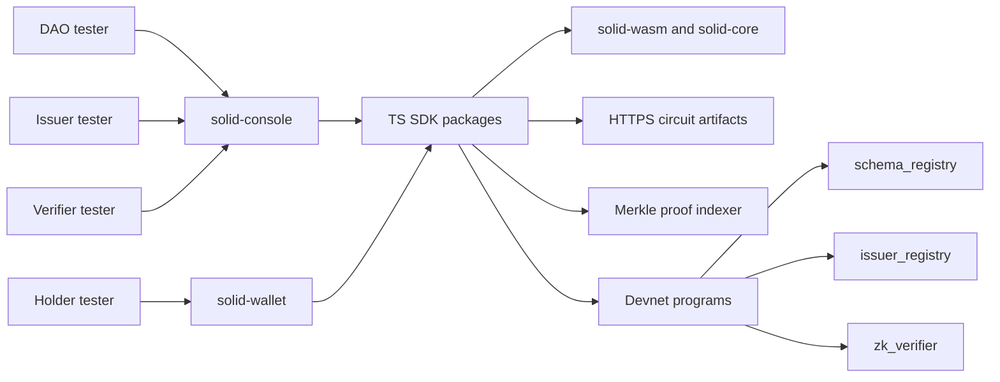

# SolID Full-System Devnet User-Testing Audit

Date: 2026-05-05
Mode: code-first comprehensive audit for public devnet user testing
Scope: `solid-protocol`, `ts-sdk`, `solid-light`, `wasm`, `solid-wallet`, `solid-console`

## Executive Summary

SolID is close to a real devnet pilot, but it is not yet ready for broad public testers without a few launch blockers being closed or explicitly accepted as devnet-only risk.

The protocol core is the strongest part of the system. The Rust/Anchor path has meaningful regression coverage, program ID gates pass, artifact hashes match the devnet manifest, and local verifier/core tests are green. The product surface is now much more real than older docs imply: issuer registration, DAO vote/finalize, verifier proof-buffer submission, wallet proof approval, wallet artifact pinning, and `window.solid` provider plumbing exist in code.

The remaining blockers are mostly deployment and trust-boundary issues:

- No live sanctioned devnet deployment has been recorded in `deployments/devnet.json` (`deployed_at`, artifact URLs, indexer URL, schemas, tree roots are still null/empty).
- Holder proof generation requires a real Merkle proof indexer and hosted pinned artifacts.
- DAO testing requires a real governance token mint and staker setup; `SOLID_TOKEN_MINT` remains a placeholder in SDK config.
- `solid-wallet` currently exposes holder/channel public material to any injected page while unlocked, with broad `<all_urls>` content-script injection.
- SDK verifier APIs can let callers log or believe "this query was verified" even though the v2 on-chain path verifies only proof/public-input bytes, not the caller's `request.query` object.
- `npm audit` reports moderate/high dependency issues in Node tooling and dependency trees.

## Current Verification Results

Commands run on 2026-05-05:

| Area | Command | Result |
| --- | --- | --- |
| Program ID gate | `python3 scripts/check_program_ids.py` | Pass |
| Devnet manifest | `npm run validate:devnet` | Pass |
| Artifact hashes | `npm run verify:artifacts` | Pass, all six manifest artifact hashes matched local files |
| Devnet config smoke | `npm run smoke:devnet-config` | Pass, but confirms null deployment fields |
| TS SDK | `cd ts-sdk && npm run build && npm test --workspaces --if-present` | Pass |
| Console tests | `cd ../solid-console && npm run test` | Pass, 13 tests |
| Wallet tests | `cd ../solid-wallet && npm run test` | Pass, 18 tests |
| Console build | `cd ../solid-console && npm run build` | Pass, large chunk warning |
| Wallet build | `cd ../solid-wallet && npm run build` | Pass, browser externalization warnings for `fs`, `path`, `os` from holder package |
| Rust fmt/tests | `cargo fmt --all -- --check && cargo test -p solid-core -p solid-light --no-fail-fast && cargo test -p zk-verifier --lib --no-fail-fast` | Pass |
| Rust clippy | `cargo clippy -p solid-core -p solid-light -- -D warnings` | Pass |
| npm audit, SDK | `cd ts-sdk && npm audit --audit-level=moderate` | Fail: 5 moderate, 3 high |
| npm audit, console | `cd ../solid-console && npm audit --audit-level=moderate` | Fail: 4 moderate, 3 high |
| npm audit, wallet | `cd ../solid-wallet && npm audit --audit-level=moderate` | Fail: 4 moderate |

Notes:

- The TS SDK test gate is not strong enough by itself. Several packages use `--passWithNoTests`.
- The wallet build succeeds, but Vite warns that Node modules from `@solid-protocol/holder` were externalized for browser compatibility. That needs targeted runtime testing in the extension background context.
- Build commands refreshed generated `dist` outputs in sibling repos. Existing working-tree changes were present before this audit and were not reverted.

## Architecture And Role Map

## Findings

### HIGH-01: Holder and Channel Public Keys Are Exposed To Any Injected Page While Wallet Is Unlocked

Confidence: 9/10
Category: Browser extension trust boundary
Location: `solid-wallet/src/content/inject.ts`, `solid-wallet/src/background/service-worker.ts`

`window.solid.requestProof` queues a proof request and opens an approval popup. By contrast, `GET_CHANNEL_PUBLIC_KEY` and `GET_HOLDER_PUBLIC_KEY` return material directly from the background service worker without user approval and without the same origin policy used for proof requests.

Because `public/manifest.json` injects the content script on `<all_urls>`, any web page visited while the wallet is unlocked can ask for:

- the channel public key used for issuer credential delivery
- schema-specific holder BabyJubJub public keys

This does not leak private keys, but it creates a privacy and correlation surface. It also lets malicious pages enumerate holder participation in schemas if they know or guess schema hashes.

Recommended remediation:

- Require explicit approval or allowlist origin policy for holder/channel key reads.
- Scope content-script `matches` to known devnet tester origins before public testing.
- Add a "connected sites" or "trusted origins" settings panel.
- Include origin and requested schema hash in the approval preview.

Priority: P0 before broad public testing; P1 if testing is limited to a small allowlisted group.

### HIGH-02: Devnet Manifest Is Still Staged, Not Deployable As Public Source Of Truth

Confidence: 10/10
Category: Deployment readiness
Location: `solid-protocol/deployments/devnet.json`

The manifest validates structurally and artifact hashes match local files, but it still has critical null/empty operational fields:

- `deployed_at: null`
- `artifacts.base_url: null`
- `indexer.url: null`
- `console.url: null`
- `wallet.release_url: null`
- `schemas: []`
- tree addresses and roots are null

This means apps can build, but real holder proof generation cannot work for testers unless each user manually supplies infrastructure values and credentials.

Recommended remediation:

- Perform the first sanctioned devnet deployment.
- Upload/publish pinned artifacts.
- Deploy the indexer/API.
- Regenerate `deployments/devnet.json`.
- Publish it at a stable HTTPS URL.

Priority: P0.

### HIGH-03: DAO Flow Requires A Real Governance Mint And Staker State

Confidence: 8/10
Category: Product readiness / governance dependency
Location: `ts-sdk/packages/sdk/src/config.ts`, `solid-console/src/roles/dao/pages/Applications.tsx`

`SOLID_TOKEN_MINT` is still a placeholder in SDK config. Console DAO voting is real enough to build and submit transactions, but it gates voting on `fetchStakerForVoter` and non-zero staked amount. Without a real token mint, faucet/distribution path, and staker setup, DAO testers cannot complete the full application vote/finalize path.

Recommended remediation:

- Deploy or choose the devnet governance token mint.
- Update manifest/config to point at the real mint.
- Provide a faucet or seed script for DAO tester stake.
- Include a DAO acceptance script that proves stake -> vote -> finalize works.

Priority: P0 for "all four roles working".

### HIGH-04: Verifier Query Object Is Not Bound To The v2 On-Chain Verification Request

Confidence: 8/10
Category: SDK/API trust boundary
Location: `ts-sdk/packages/verifier/src/index.ts`, `ts-sdk/packages/sdk/src/index.ts`

The v2 proof-buffer path verifies proof bytes and public inputs on-chain. It does not serialize or enforce the caller's `VerificationRequest.query` object. This is fine if callers treat public inputs and proof verification as the source of truth, but dangerous if UI or backend logs say "requirement X was verified" based on a mismatched local query object.

Recommended remediation:

- Add a preflight that reconstructs the expected public input slots from `requirement/query` and rejects mismatch before transaction build.
- Make logs and return values derive the verified predicates from public inputs, not caller-owned query objects.
- Add tests for query/public-signal mismatch rejection.

Priority: P1 before external integrator pilots; P0 if the public demo relies on requirement-level claims.

### MEDIUM-01: Batch Proof Verification Does Not Require `vk_finalized`

Confidence: 7/10
Category: Protocol operations / VK lifecycle
Location: `programs/zk-verifier/src/lib.rs`

The batch verifier path requires VK initialization and unpaused config, but does not require `vk_finalized`. The subgroup verification path does require finalized subgroup VK. If deployment scripts leave the batch VK uploaded but not finalized, proofs can be verified against a mutable VK before the freeze/timelock gate is active.

This is not a direct attacker exploit if the deployment authority is trusted, but it weakens deployment ceremony guarantees and can confuse public trust claims.

Recommended remediation:

- Require `vk_finalized` in `verify_batch_proof` and `verify_batch_proof_v2`, or document and enforce finalization as a hard deploy gate.
- Keep `scripts/verify_freeze_gate.ts` in the runbook and require it before exposing the console.

Priority: P1 for devnet, P0 for mainnet.

### MEDIUM-02: Indexer JSON Is Fully Trusted By Holder Proof Generation

Confidence: 8/10
Category: Off-chain trust boundary
Location: `solid-wallet/src/background/proof-engine.ts`, `ts-sdk/packages/sdk/src/indexer.ts`

Holder proof generation consumes Merkle paths from the configured indexer over HTTPS. The SDK/wallet validate shape and root consistency within proof generation, but there is no independent RPC reconciliation, signed response, lag rejection, or root freshness policy.

Recommended remediation:

- Add indexer health fields: root slot, last processed slot, lag slots, manifest hash.
- Reject proof generation if lag exceeds a configured threshold.
- Cross-check issuer/schema binding roots against Solana RPC before accepting an indexer proof for public deployments.
- Long term: sign indexer snapshots or make the root proof source verifiable.

Priority: P1 for reliable user testing.

### MEDIUM-03: Extension Permissions Are Too Broad For Public Internet Testing

Confidence: 9/10
Category: Browser extension hardening
Location: `solid-wallet/public/manifest.json`

The extension declares:

- `content_scripts.matches: ["<all_urls>"]`
- `host_permissions: ["https://*/*", "http://localhost/*", "http://127.0.0.1/*"]`

This makes early testing convenient but too broad for a public pilot. It increases privacy exposure, makes accidental provider injection likely, and amplifies HIGH-01.

Recommended remediation:

- For devnet launch, restrict `matches` and `host_permissions` to the deployed console/demo/artifact/indexer origins.
- Move broad access behind optional permissions only if needed.

Priority: P0/P1 depending on tester scope.

### MEDIUM-04: Browser Build Warnings Indicate Holder SDK Runtime Risk In Extension

Confidence: 7/10
Category: Browser compatibility
Location: `solid-wallet` build, `ts-sdk/packages/holder/dist/index.js`

The wallet production build succeeds, but Vite externalizes `fs`, `path`, and `os` imported by the holder package for browser compatibility. If those branches are reached in the extension service worker, proof generation can fail at runtime.

Recommended remediation:

- Run a real extension proof generation smoke test in Chrome/Brave.
- Move debug-only Node imports behind safe dynamic guards that bundlers can tree-shake.
- Add a wallet build test that exercises `generateProofForEnvelope` in a browser-like environment with mocked artifacts/indexer.

Priority: P1.

### MEDIUM-05: SDK Test Coverage Is Too Thin For Public Package Reliance

Confidence: 10/10
Category: Test coverage
Location: `ts-sdk/packages/*/package.json`

The SDK workspace builds and tests, but several packages pass with no tests. Current package coverage does not sufficiently protect:

- verifier proof-buffer encoding
- holder batch proving/public input binding
- artifact CDN pin failures
- `extractWirePublicInputs` vs on-chain slot map
- indexer malicious/stale JSON
- browser/WASM loading behavior

Recommended remediation:

- Add at least one meaningful test per package.
- Add cross-layer tests for verifier slot map and proof-buffer payloads.
- Add browser-like tests for wallet/holder artifact loading.

Priority: P1.

### MEDIUM-06: npm Audit Reports Vulnerable Tooling And Transitive Packages

Confidence: 10/10
Category: Supply chain
Location: `ts-sdk/package-lock.json`, `solid-console/package-lock.json`, `solid-wallet/package-lock.json`

Observed audit failures:

- `esbuild <=0.24.2` via Vite/Vitest, moderate dev-server request exposure.
- `underscore <=1.13.7` via `jsonpath`/`bfj`, high DoS advisory in SDK/console dependency trees.
- `uuid 11.0.0 - 11.1.0`, moderate advisory under `rpc-websockets` in SDK tree.

Recommended remediation:

- Upgrade Vite/Vitest/esbuild on a controlled branch and rerun builds.
- Resolve `bfj/jsonpath/underscore` dependency path where feasible.
- Document which advisories are dev-only versus shipped runtime.

Priority: P1 before public repo promotion; P2 if private controlled testing.

### LOW-01: Console Displays Hardcoded Devnet Labels/Links

Confidence: 8/10
Category: UX/config correctness
Location: `solid-console/src/layout/TopBar.tsx`, `solid-console/src/roles/verifier/pages/VerifyProof.tsx`, `solid-console/src/roles/dao/pages/Applications.tsx`

The app can be configured via manifest/env, but some labels and explorer links hardcode `devnet`. This can mislead testers if a custom RPC, localnet, or future mainnet endpoint is used.

Recommended remediation:

- Derive cluster label and explorer query from manifest/env.

Priority: P2 for devnet, P1 before multi-cluster testing.

### LOW-02: Console `fetchRegistryOverview` Does Not Populate Global Binding

Confidence: 8/10
Category: Product completeness
Location: `solid-console/src/lib/registry.ts`

The overview function returns `globalBinding: null` even though the manifest/registry surface names global binding as part of deployment state.

Recommended remediation:

- Read and display global binding PDA/root/slot once devnet is deployed.

Priority: P2.

### INFO-01: Some Older Docs Are Stale Relative To Code

Confidence: 10/10
Category: Documentation drift
Location: `plan/DEVNET_READINESS_CHECKLIST.md`, `docs/DEVNET_STATUS.md`, app source files

Older readiness rows mark some flows as mock/open even though current source implements real paths, including issuer registration, DAO vote/finalize, verifier proof-buffer flow, wallet proof request popup, and artifact pin checks.

Recommended remediation:

- Update readiness docs after this audit so product planning reflects source reality.

Priority: P2.

## Deployment Blockers For "All Four Roles Working"

| Role | Blocking item |
| --- | --- |
| DAO | Real governance mint, DAO/staker seed path, live registry config, deployed issuer application |
| Issuer | Live devnet programs, subgroup artifacts hosted, real schema/tree config, holder wallet material |
| Holder | Hosted artifacts, Merkle proof indexer, real encrypted credential envelope, extension origin policy decision |
| Verifier | Live verifier config and finalized VK, schema/issuer/global tree roots, proof-buffer tx flow funded by payer |

## Remediation Roadmap

### P0: Required before broad public devnet testing

1. Deploy protocol and publish a populated manifest.
2. Host pinned artifacts over HTTPS with sidecars.
3. Deploy the Merkle proof/indexer API.
4. Deploy or configure the governance mint and DAO staker seed path.
5. Restrict wallet content-script origins or add approval/allowlist for holder/channel key reads.
6. Run the four-role acceptance test against the live URLs.

### P1: Required before external integrator pilots

1. Add SDK query/public-signal mismatch guard.
2. Require or operationally enforce batch VK finalization before verification.
3. Add indexer freshness/lag/root checks.
4. Resolve browser build warnings around holder SDK Node imports.
5. Add meaningful SDK tests for verifier/holder/light paths.
6. Triage npm audit advisories and upgrade dependencies where safe.

### P2: Required before mainnet or larger launch

1. Multi-party trusted setup.
2. Governance multisigs for slash/fraud/tree operator paths.
3. Formalize SDK package publishing and release verification.
4. Harden console security headers with CSP/HSTS/frame policy.
5. Replace hardcoded cluster labels and explorer links.

## Ship Decision

Current status: **not yet ready for broad public testing**.

It is ready for a controlled internal/devnet dry run once the missing infrastructure is deployed. For public feedback from real users, the P0 items above should be closed first.

