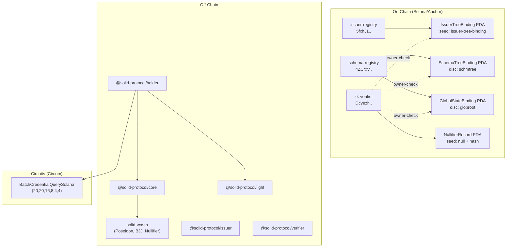

# SolID Protocol — Deep Comprehensive System Audit

> **Scope**: Code-first, full-stack audit across all 3 Solana programs, 2 Rust crates, 1 Circom circuit suite, 1 WASM bridge, and the full TypeScript SDK (6 packages). Docs are referenced only for context.

---

## 1. System Assessment — What I Think of This System

**Verdict: This is one of the most architecturally rigorous ZK-identity systems I've seen built on Solana.** The protocol demonstrates deep understanding of the cryptographic attack surface — every major class of ZK vulnerability (nullifier replay, forged trust roots, subgroup attacks, stale-leaf exploits, query malleability) has been identified and either closed or explicitly tracked with a bypass gate.

**Strengths:**
- **Atomic state transitions (ADR-0014)** — The `revoke_issuer_atomic` / `request_withdrawal_atomic` paths that synchronize on-chain `IssuerStatus` with SPL AC Merkle tree state in one instruction are load-bearing and correctly implemented. The Keccak root recomputation in `compute_concurrent_merkle_root_keccak` is sound.
- **Nullifier hardening (SEC-008)** — The 6-input Poseidon nullifier binding `issuerTreeRoot` as its 6th input is an elegant solution to epoch replay. Both directions of the epoch boundary are closed.
- **Cross-language consistency** — The WASM bridge (`solid-wasm`) is the single source of truth for all crypto, used by the TS SDK. No crypto is reimplemented in TypeScript.
- **Regression test density** — The codebase has an exceptional number of "doc-as-test" guards: program ID drift gates, discriminator matching, layout-size assertions, public-input index pins, and timelock constant pins.
- **Raw-byte PDA parsing** — The `SchemaTreeBinding` / `IssuerTreeBinding` parsers in `solid-light` avoid Anchor's Borsh overhead for cross-program reads, with discriminator + bounds checks at every parse site.

**Weaknesses:**
- **SEC-048 bypass is load-bearing** — The BJJ subgroup check is currently off-chain only. The `sec007-skip-onchain` feature flag is the single largest trust assumption in the system.
- **Single integration test** — Only `01_registry_init.test.ts` exists. No E2E test covers the issue→prove→verify pipeline.
- **No trusted setup artifacts** — The circuit is defined but no `.zkey` / `.wasm` / VK artifacts are committed. E2E cannot run without them.
- **SDK `queryContextHash` divergence** — The single-credential `generateProof` path computes `queryContextHash` differently from the batch circuit's Step 4 (see §3 below).

---

## 2. Architecture Map (Code-Derived)



---

## 3. Critical Findings

### CRIT-01: `queryContextHash` Divergence (Single-Credential Path)

| Property | Value |
|---|---|
| **Severity** | 🔴 High |
| **Files** | [holder/index.ts](file:///c:/Users/KIIT/Desktop/solid-protocol/ts-sdk/packages/holder/src/index.ts#L808-L827), [batch_credential_query.circom](file:///c:/Users/KIIT/Desktop/solid-protocol/circuits/batch_credential_query.circom#L408-L430) |

The single-credential `generateProof()` path (line 136) calls `computeQueryContextHash(query)` which uses a **flat Poseidon** over `[schemaHash, fieldIndex₀, op₀, val₀, ..., numPreds, logic, expiration]` — a variable-arity hash with `schemaHash` as the first input and `expirationTimestamp` as the last.

The **circuit's Step 4** (lines 411-430) uses a **two-layer Poseidon tree**: `Poseidon(8)` over interleaved `(credIndex, fieldIndex)` pairs, a separate `Poseidon(8)` over `(operator, value)` pairs, then `Poseidon(4)` over `[hIndices, hOps, numPredicates, compoundLogic]`.

These produce **different hash values** for the same query. Any proof generated via the single-credential path will have a nullifier that does not match what the circuit computes, causing the holder's own sanity check (line 268) to throw `"Nullifier mismatch"`.

**Impact**: The single-credential `generateProof()` is broken for the batch circuit. Only `generateBatchProof()` works.

**Fix**: Either remove `generateProof()` or align its `computeQueryContextHash` to match the circuit's two-layer structure. The batch path's `QueryBuilder._computeContextHash()` in core already matches the circuit.

---

### CRIT-02: No Trusted Setup Artifacts

| Property | Value |
|---|---|
| **Severity** | 🔴 Blocker |
| **Files** | Circuit output dir (missing `.zkey`, `.wasm`, `verification_key.json`) |

The circuit `batch_credential_query.circom` is defined with params `(20, 20, 16, 8, 4, 4)` but no compiled artifacts exist in the repo. The holder SDK's `generateBatchProof()` requires `circuitPaths.wasmPath` and `circuitPaths.zkeyPath`. The on-chain `zk-verifier` requires a stored VK via `store_verification_key`.

**E2E is impossible without**:
1. `circom batch_credential_query.circom --r1cs --wasm --sym`
2. Powers-of-tau ceremony + phase 2 contribution
3. `snarkjs zkey export verificationkey` → JSON → chunked on-chain upload

---

### CRIT-03: `toCircuitInputs()` Stale Layout (Core SDK)

| Property | Value |
|---|---|
| **Severity** | 🟡 Medium |
| **File** | [core/index.ts](file:///c:/Users/KIIT/Desktop/solid-protocol/ts-sdk/packages/core/src/index.ts#L457-L492) |

`QueryBuilder.toCircuitInputs()` (line 457) comments say "31 inputs" but post-ADR-0014 the circuit has **32 public inputs** (`NR_PUBLIC_INPUTS = 32`). The method does not emit `issuerTreeRoot` at all, and its index comments (`"Indices 1-6"`, `"Indices 7-30"`, `"Index 31-33"`) are stale.

This method is not consumed by `generateBatchProof()` (which builds its own `circuitInput` object), so it's currently dead code — but any consumer that tries to use it will get an incompatible input vector.

---

## 4. E2E Blockers — Complete List

These are the items that **must** be resolved to run issue→prove→verify without workarounds:

### B1: Trusted Setup (Circuit Compilation + Ceremony)

**What**: Compile the circuit, run a trusted setup, export VK.
**Why**: No `.wasm`, `.zkey`, or `verification_key.json` exist. `snarkjs.groth16.fullProve()` needs them; `store_verification_key` needs the VK bytes.
**How**: 
```bash
circom circuits/batch_credential_query.circom --r1cs --wasm --sym -o build/
snarkjs groth16 setup build/batch_credential_query.r1cs pot_final.ptau circuit.zkey
snarkjs zkey contribute circuit.zkey circuit_final.zkey
snarkjs zkey export verificationkey circuit_final.zkey verification_key.json
```

### B2: Bootstrap Sequence Execution

**What**: The following must be called in order on a fresh localnet:
1. `initialize_registry` (issuer-registry) — creates `RegistryConfig` + governance vault
2. `initialize` (schema-registry) — creates `SchemaRegistryConfig`  
3. `initialize_issuer_tree_binding` (issuer-registry) — creates the singleton `IssuerTreeBinding` PDA
4. `initialize` (zk-verifier) — creates `VerifierConfig`
5. `store_verification_key` (zk-verifier, chunked) — uploads VK
6. `finalize_verification_key` (zk-verifier) — freezes VK

**Status**: `scripts/bootstrap.sh` and `scripts/initialize.ts` exist but have not been validated against the current program state. The `initialize_registry` instruction now requires a real SPL Mint (not `Pubkey::default()`), which the test `01_registry_init.test.ts` confirms.

### B3: Schema + Tree Registration

**What**: For each credential schema:
1. `register_schema` (schema-registry)
2. Create SPL AC concurrent Merkle tree account
3. `register_schema_tree` (schema-registry) — creates `SchemaTreeBinding`

**Why**: `issue_credential` validates the `SchemaTreeBinding` PDA via `verify_schema_tree_binding_for_issue()`.

### B4: Issuer Registration + Tree Enrollment

**What**: For each issuer:
1. `register_issuer` (issuer-registry) — creates `IssuerAccount` in `Pending` status
2. DAO voting + `finalize_vote` → `Approved`
3. `append_issuer_leaf` (issuer-registry) — CPI into SPL AC to append the issuer leaf, sets `is_tree_enrolled = true`
4. `update_issuer_tree_root` — refreshes `IssuerTreeBinding.current_root`

**Why**: The circuit requires issuer-tree membership proof per active credential (STEP 0.75). `verify_batch_proof` checks `IssuerTreeBinding.current_root`.

### B5: Global State Tree + Identity Registration

**What**: 
1. Create global SPL AC tree
2. `initialize_global_binding` (schema-registry) — creates `GlobalStateBinding` PDA
3. For each holder×schema: insert `identityState = Poseidon(derivedPubKeyAx, derivedPubKeyAy, revocationNonce)` into global tree
4. `update_global_root` (schema-registry)

**Why**: Circuit STEP 0.5 (`IdentityAnchor`) requires global-tree membership per active credential.

### B6: Credential Issuance Path

**What**: `issue_credential` (issuer-registry) → CPI `append` into SPL AC per-schema tree. The holder SDK must then store the full `StoredCredential` including ADR-0014 fields (`issuerAuthority`, `issuerStatusEpoch`, `issuerRevocationNonce`, `issuerTreeLeafIndex`).

**Status**: The instruction exists and is hardened (SEC-003 schema-tree binding gate). The `scripts/issue.ts` script exists.

### B7: Merkle Proof Adapter

**What**: `@solid-protocol/light` defines a `MerkleProofAdapter` interface. An adapter that can serve proofs for SPL AC trees must be available. Options:
- Helius DAS API (production)
- `LocalReplicaAdapter` (test — needs implementation from event replay)
- Direct SPL AC account parsing

**Why**: `generateBatchProof()` calls `lightFetchMerkleProof()` for every credential, global identity leaf, and issuer leaf.

### B8: WASM Build

**What**: The WASM bridge must be compiled:
```bash
wasm-pack build wasm/ --target nodejs --out-dir ts-sdk/packages/core/wasm --release
```
**Why**: `initWasm()` imports `../wasm/solid_wasm.js`. Without the build artifacts, every SDK function throws "WASM not initialized".

### B9: SEC-048 BJJ Subgroup Check

**What**: The on-chain `register_issuer` skips the BJJ prime-order subgroup check when compiled with `sec007-skip-onchain`. The off-chain `isInPrimeOrderSubgroup()` is the current enforcement point.

**E2E Impact**: This is **not** a blocker for localnet E2E testing (the bypass emits a `Sec007Bypass` event but proceeds). It **is** a mainnet blocker.

**Resolution path**: Either:
- Move the check into the credential-issuance circuit (free in R1CS)
- Use Solana's upcoming precompiles for EC ops
- Accept the off-chain-only check with monitoring on `Sec007Bypass` events

---

## 5. Security Registry (Code-Verified)

| ID | Title | Status | Gate |
|---|---|---|---|
| SEC-001 | Query index bounds | ✅ Fixed | `credIdxChecks`/`fieldIdxChecks` in circuit L147-159 |
| SEC-003 | Schema-tree binding gate | ✅ Fixed | `verify_schema_tree_binding_for_issue()` |
| SEC-004 | Issuer-tree membership | ✅ Fixed | Circuit STEP 0.75 + on-chain root check |
| SEC-005 | Timestamp skew | ✅ Fixed | `CURRENT_TIMESTAMP_INPUT_INDEX=31`, 600s default |
| SEC-006 | VK freeze + rotation timelock | ✅ Fixed | 48h timelock, `vk_finalized` flag |
| SEC-007/048 | BJJ subgroup check | ⚠️ Off-chain only | `sec007-skip-onchain` feature gate |
| SEC-008 | Epoch replay (nullifier) | ✅ Fixed | 6-input Poseidon with `issuerTreeRoot` |
| SEC-009 | WASM bridge safety | ✅ Fixed | No shared buffer, clean marshal path |
| SEC-020 | Canonical ordering | ✅ Fixed | `LessThanBN254` circuit + SDK sort |
| SEC-029 | Padding slot leakage | ✅ Fixed | `enabled` flag + zero-constraints |
| SEC-030 | Stake vault rent drain | ✅ Fixed | `min_rent` check in `transfer_slashed_lamports` |
| SEC-031 | Pubkey endianness | ✅ Fixed | `bufToDecimalBE` for Solana pubkeys |
| SEC-032 | Program ID drift | ✅ Fixed | Dual-layer byte/string tests in `solid-light` |
| SEC-033 | Identity cohesion | ✅ Fixed | Derived-key comparison in holder SDK |
| SEC-044 | Cooldown atomic | ✅ Fixed | `request_withdrawal_atomic` |
| SEC-045 | Atomic binding update | ✅ Fixed | In-handler root recomputation |

---

## 6. Cross-Layer Consistency Verification

### 6a. Public Input Layout

The circuit declares 32 public inputs (line 21-35 of `batch_credential_query.circom`). The on-chain verifier pins:

| Slot | Name | Circuit | On-chain constant | Match? |
|---|---|---|---|---|
| 0 | nullifierHash | output signal | `publicSignals[0]` | ✅ |
| 10 | issuerTreeRoot | `signal input` | `ISSUER_TREE_ROOT_INPUT_INDEX = 10` | ✅ |
| 29 | verifierAddress | `signal input` | `VERIFIER_ADDRESS_INPUT_INDEX = 29` | ✅ |
| 31 | currentTimestamp | `signal input` | `CURRENT_TIMESTAMP_INPUT_INDEX = 31` | ✅ |

The on-chain `NR_PUBLIC_INPUTS = 32`, `MAX_IC = 33`. VK IC table is heap-allocated with `MAX_IC` cap. All consistent.

### 6b. Issuer Leaf Composition

| Layer | Formula | Match? |
|---|---|---|
| Circuit (L281-286) | `Poseidon(authority, pubKeyAx, pubKeyAy, statusEpoch, revNonce)` | — |
| On-chain Rust | `compute_issuer_leaf_bytes()` uses same 5-input Poseidon via `solid-core` | ✅ |
| TS SDK (core L273-301) | `computeIssuerLeaf()` → `poseidonHashBytes([auth, x, y, epoch32, nonce32])` | ✅ |

### 6c. Nullifier Composition  

| Layer | Formula | Match? |
|---|---|---|
| Circuit (L451-458) | `Poseidon(masterKey, revNonce, verifierAddr, queryCtxHash, verifierNonce, issuerTreeRoot)` | — |
| WASM (`computeHardenedNullifier`) | 6-input Poseidon, same order | ✅ |
| TS SDK (core L228-241) | Calls `computeHardenedNullifier` via WASM | ✅ |
| Holder (L140-147) | Passes all 6 args including `issuerTreeRoot` | ✅ |

### 6d. Tree Depths

| Parameter | Circuit | SDK | On-chain | Match? |
|---|---|---|---|---|
| TREE_DEPTH | 20 | 20 (holder L456) | N/A (SPL AC config) | ✅ |
| GLOBAL_DEPTH | 20 | 20 (holder L457) | N/A | ✅ |
| ISSUER_TREE_DEPTH | 16 | 16 (holder L458) | 16 (`solid-light` L499) | ✅ |

---

## 7. Things to Fix/Improve Before E2E

### Priority 1 — Must Fix

1. **Remove or fix `generateProof()` single-credential path** — The `computeQueryContextHash` function does not match the circuit. Either delete it or rewrite it to match the batch circuit's Step 4 hash structure.

2. **Fix `toCircuitInputs()` in QueryBuilder** — Add `issuerTreeRoot` field, update comments to say 32 inputs. Or mark it as deprecated.

3. **Compile circuits and run trusted setup** — This is the #1 mechanical blocker. ~2 hours of work.

4. **Build WASM bridge** — `wasm-pack build wasm/ --target nodejs`. Verify output lands in `ts-sdk/packages/core/wasm/`.

5. **Validate `bootstrap.sh` against current program state** — The `initialize_registry` signature changed (now requires real Mint + governance params). Ensure the bootstrap script reflects this.

### Priority 2 — Should Fix

6. **Create a `LocalReplicaAdapter`** — For localnet E2E testing, you need a Merkle proof source that doesn't require Helius DAS. Build one that subscribes to SPL AC transaction logs and maintains an in-memory tree replica.

7. **Add E2E integration test** — Extend `tests/integration/` with a test that covers: register schema → register issuer → vote → approve → enroll in tree → issue credential → generate batch proof → verify on-chain.

8. **Validate test vectors** — `tests/vectors/commitment_and_nullifier.json` exists but `check_vectors.ts` must be run against the current WASM build to confirm cross-language compatibility.

9. **Wire `issuerAuthority` byte-order in circuit** — The circuit takes `issuerAuthorities[i]` as a field element. The SDK passes `bufToDecimal(c.issuerAuthority.toBytes())` which is **LE interpretation**. But the on-chain `compute_issuer_leaf_bytes` feeds raw 32-byte `authority.to_bytes()` into Poseidon. Verify these produce the same field element — Solana pubkey bytes are neither LE nor BE (they're just bytes), so the LE interpretation in `bufToDecimal` should match the raw-byte-to-field-element conversion in `solid-core::poseidon`. **Verify with test vectors.**

### Priority 3 — Nice to Have

10. **Circuit unit tests for ADR-0014** — The `circuits/test/` directory has tests for `babypbk254`, `lt_bn254`, `padding_slot`, `identity_anchor`, and `batch_range_checks` — but no test for the issuer-tree inclusion sub-circuit (`MerkleInclusion` with the 5-input Poseidon leaf).

11. **Remove `/tmp` debug path** — `holder/index.ts` line 682 writes to `/tmp/solid-circuit-input.json`. This won't work on Windows and should use `os.tmpdir()` or the workspace.

---

## 8. Recommended E2E Test Sequence

```
1. anchor build                         # compile programs
2. wasm-pack build wasm/ ...            # build WASM bridge
3. circom compile + trusted setup       # generate .wasm + .zkey + VK
4. solana-test-validator (or bankrun)    # start local validator
5. bootstrap.sh                         # deploy programs, init registries
6. register_schema + tree               # per-schema setup
7. register_issuer + vote + approve     # issuer onboarding
8. append_issuer_leaf + update_root     # tree enrollment
9. Global tree: insert identity leaves
10. issue_credential                    # CPI append into schema tree
11. generateBatchProof()                # holder generates ZK proof
12. verify_batch_proof                  # on-chain verification
13. Assert: NullifierRecord PDA exists
14. Assert: replay (same nullifier) fails with AlreadyInitialized
```

---

## 9. Summary

| Dimension | Rating | Notes |
|---|---|---|
| **Architecture** | ⭐⭐⭐⭐⭐ | Dual-registry + atomic tree updates is production-grade |
| **Crypto Correctness** | ⭐⭐⭐⭐ | Sound design; SEC-048 bypass is the gap |
| **Code Quality** | ⭐⭐⭐⭐⭐ | Exceptional comment density, regression gates everywhere |
| **Test Coverage** | ⭐⭐½ | Strong unit tests; weak integration/E2E |
| **E2E Readiness** | ⭐⭐ | Blocked by trusted setup + adapter + bootstrap validation |
| **Security Posture** | ⭐⭐⭐⭐ | 15/16 tracked findings closed; SEC-048 open but gated |

The system is in a **"last-mile"** state. The hardest cryptographic and architectural problems are solved. What remains is mechanical: compile the circuit, run the trusted setup, validate the bootstrap sequence, and wire up a Merkle proof adapter for localnet. Once those are done, the E2E test sequence above should produce a valid on-chain proof verification.
